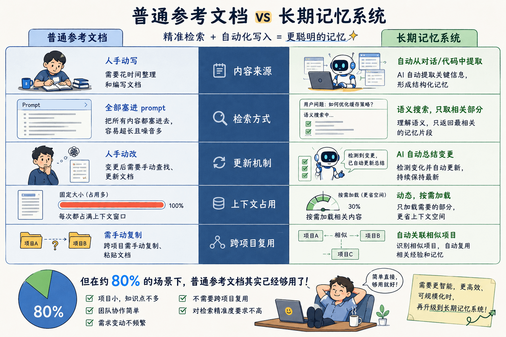

# 告别 AI "失忆"：代码项目长期记忆的轻量级构建指南

**本文适合**

- 正在使用 AI Coding 工具，被 AI **"记不住规范""任务跑偏"** 困扰的开发者。

- **希望用轻量级方案解决 AI 记忆问题的个人或小型团队**——不需要懂 RAG、向量库或机器学习，看完就能上手。

**不适合**

- **想深入研究底层技术的 ML 工程师**——本文不涉及 RAG 架构设计、Fine-tuning 策略或 Agent 框架开发，这些属于另一个技术深度。

你是否有过这样的经历：AI刚帮你写完一个组件，下一个任务就忘了代码风格；明明交代过不要用某个库，它又固执地引入；项目进行到一半，AI开始天马行空，完全偏离初衷。

这不是AI"不够聪明"，而是它缺乏**长期记忆**。

## AI为什么"失忆"？

在不做任何设置的前提下，当前的 AI（包括 GPT、Claude、Gemini 等）本质上是一个**没有持久化状态的超级推理引擎**：

- 它能解答复杂问题，但**不记得你上个月说过什么；**

- 它能写出优雅代码，但**不知道关于你项目的特殊约定；**

- 它能遵循指令，但**超过上下文窗口就遗忘；**

对大模型而言，**每次对话都是全新开始。**

所谓"长期记忆"，就是通过外部工程手段让 AI 记住该记住的，忘记该忘记的。

### 本质认知：长期记忆的技术实现

当前主流 LLM 均为**无状态架构（Stateless）**，不具备跨会话的持久化记忆。业界的"AI 记忆"方案，在绝大多数场景（约 80%）下可抽象为同一范式：


```
长期记忆 = 外部知识库（参考文档） + 上下文注入（Prompt 加载）
```

其本质并非让模型"学会"记忆，而是通过工程手段在每次推理前完成**知识预加载。**

长期记忆系统与普通参考文档的差异点在于**检索的精准度和写入的自动化**，用一张图对比如下。



当上下文放不下全部规范，当我们需要跨团队协作、跨项目继承规范时，我们需要引入包含向量检索、防遗忘机制等在内的长期记忆系统。

## 如何让Agent具备长期记忆？

### Level 1：文档化规范（覆盖 80% 场景）

**核心机制：** 通过静态规范文件（Style Guide）实现知识持久化，在每次会话启动时通过系统提示（System Prompt）强制加载。

```
# .style-guide.md（你的项目规范）

## 必须遵守
- 配色：#D4A574（暖棕色）
- 字体：思源黑体
- 组件库：Ant Design 5.x

## 禁止事项
- 不要用Tailwind CSS
- 不要改全局间距
```

每次启动 AI 时：

```
【永久记忆加载】
1. 阅读项目根目录的 .style-guide.md
2. 严格遵守其中的约束
3. 如需偏离，先询问我

【本次任务】...
```

**优点：** 零技术成本，立即可用

**适用：** 个人项目、小型团队、规范 < 50 页

### Level 2：模板驱动（代码类项目最佳）

**核心机制：** 创建标准模板 + 示例文件，通过结构约束确保输出一致性。

```
/project
  /templates
    note-template.html     # 固定结构
    component-template.tsx
  /examples
    good-example-1.tsx     # 正向示例
    bad-example.tsx        # 反向示例（告诉AI不要学）
```

**使用方式**：生成新代码时，要求AI"严格参照template，保持结构一致，参考good-example"

**效果**：示例项目中，代码一致性从60%提升到95%

### Level 3：向量数据库（需要语义检索时）

**触发条件（满足任一即考虑升级）**：

- 规范文档超过50页，无法一次性放入上下文

- 需要模糊匹配（如"钱还能拿回来吗"匹配"退款政策"）

- 需要跨项目继承知识

**典型架构示例（Python + Chroma）**

```python
from chromadb import Client

# 存储：每次代码review的决策
client.add(
    documents=["不要用useEffect监听props变化，会导致无限循环"],
    metadatas=[{"file": "UserProfile.tsx", "author": "张三"}]
)

# 检索：写新代码时
results = client.query("useEffect 依赖项怎么写")
# 返回：之前的教训 + 解决方案
```

**优点**：语义搜索，自动关联

**缺点**：需要额外基础设施

### Level 4：建立遗忘机制（长期项目必需）

**典型冲突场景：** 技术栈迭代导致的记忆失效

假设项目于 2025 年 Q1 的规范为"使用 React Class Component"，而 2026 年 Q1 已全面迁移至 Hooks。若缺乏遗忘机制，AI 将持续引用已废弃的范式，造成技术债务。

**解决方案对比：**

|          |                           |            |
|:---------|:--------------------------|:-----------|
| **方法** | **实现**                  | **适用**   |
| 手动标注 | [过期:2026-06-01]旧规范   | 小项目     |
| 时间衰减 | 记忆权重 = 1/(天数+1)     | 偏好变化快 |
| 冲突检测 | 新旧矛盾时主动询问        | 关键决策   |

**关键原则**：**没有遗忘的记忆是债务，不是资产**

我们用一个真实案例，来帮助大家更好地了解如何构建长期记忆系统。

### 真实案例：用CoStrict搭建一个读书笔记网站

#### 场景描述

- 构建个人读书笔记网站，每本书一个独立页面

- 已有20篇笔记，未来还会增加

- 要求：所有笔记**UI风格、结构、交互完全一致**

- 痛点：AI每次生成新页面，总有细微差异（如颜色偏差、元素位置改变、交互方式不一致）

#### 解决方案

1.  **创建风格规范文件** `.style-guide.md`

```
# .style-guide.md

## 页面结构（从上到下固定顺序）
1. 返回首页按钮（左上角，class="back-home"）
2. 书籍封面图（居中，max-width:300px）
3. 书名（H1）
4. 作者（H3，斜体）
5. 评分（星标组件，1-5星，金色填充动画）

## 颜色变量
--bg-color: #FAF8F5
--text-color: #2C3E50
--accent: #D4A574

## 响应式断点
移动端: <640px（内边距20px）
桌面端: >1024px（内边距40px，最大宽度800px居中）
```

2.  **创建HTML模板** `/templates/note-template.html`

```html
<div class="container">
    <a href="/" class="back-home">← 返回首页</a>
    <div class="book-cover"></div>
    <h1>{{书名}}</h1>
    <div class="rating" data-rating="{{评分}}"></div>
    <!-- 固定结构，只替换{{变量}} -->
</div>
```

<!-- -->

3.  **每次生成时的Prompt模板**

```
【长期记忆加载】
1. 阅读 .style-guide.md
2. 阅读 /templates/note-template.html
3. 查看 /notes/ 下任意3篇已有笔记

【新笔记数据】
书名：《Thinking, Fast and Slow》
作者：Daniel Kahneman
评分：5星
摘录：...

【核心要求】
- 严格保持HTML结构，不要增删元素
- 使用规范中定义的颜色
- 生成后自查检查清单
```

4.  **使用检查清单（Checklist）防跑偏**

```
# .ai-instructions（AI必读）

## 生成后自查
- [ ] 是否使用了规范中的颜色（#D4A574）？
- [ ] 封面图是否居中、max-width:300px？
- [ ] 评分组件是否1-5星（不是10星，不是数字）？
- [ ] 移动端打开，内边距是否为20px？
- [ ] 返回按钮是否在左上角，文字是"返回首页"？
```

### 使用前后的效果对比

|            |                       |                   |
|:----------:|:---------------------:|:-----------------:|
|  **指标**  |      **使用前**       |    **使用后**     |
| 风格一致性 | 60%（每次需手工调整） |  98%（直接可用）  |
|  生成时间  | 15分钟（含反复修改）  | 3分钟（一次通过） |
|  维护成本  |    每篇都要写样式     |  零（模板复用）   |

### 关键心得

1.  **不需要高级技术**：没有向量库，没有自动摘要，只是"文档+模板+检查清单"

2.  **对比示例很重要**：让AI看3篇旧笔记，比100条文字指令更有效

3.  **自查清单比指令有用**：有了Checklist，AI会主动检查，这比我们的事后发现更有效

## 何时需要升级到"高级记忆"？

80% 的场景用"文档+模板"就够了。但当你遇到以下瓶颈时，需要渐进式升级。

### 瓶颈一：精确匹配不够用，需要语义检索

#### 是否需要向量数据库的判断标准（满足任一即考虑）

|                |                      |                  |
|:---------------|:---------------------|:-----------------|
| **判断标准**   | **量化指标**         | **典型场景**     |
| 规范文档过大   | >50页 或 >100KB      | 企业设计系统文档 |
| 需要模糊匹配   | "用户说A，匹配文档B" | 客服知识库       |
| 跨项目知识复用 | 项目A经验用于项目B   | 多项目开发       |
| 内容自动推荐   | "相关笔记""相似代码" | 推荐系统         |

#### 典型场景1：规范文档过大

```
问题表现:
  - 你有100页的设计系统文档（颜色、组件、交互、动画...）
  - AI的上下文窗口装不下（128K token ≈ 50页中文）
  - 你手动摘录关键部分，但总遗漏重要约束

向量库的解决方案:
  1. 把100页文档分块（每块500字）
  2. 存入向量数据库
  3. 每次生成代码时，先检索相关块（只取top-5，约5页）
  4. 上下文从100页降到5页

效果: AI能记住所有规范，但只加载相关的
```

#### 典型场景2：跨项目知识库复用

```
问题表现:
  - 你在公司维护3个不同项目（电商、CMS、数据分析平台）
  - 项目A解决了"大文件分片上传"，项目B也需要
  - 但AI不知道项目A的经验，每次重新造轮子

向量库的解决方案:
  1. 所有项目的技术决策都存入同一个向量库（带project标签）
  2. 在项目B工作时，检索时包含project=B，但也检索project=A的相关经验
  3. AI提示："项目A中处理过大文件上传，使用了分片+断点续传，要参考吗？"

效果: 知识在公司内流动，新人也能利用老项目的经验
```

#### 决策树：用不用向量库？

```
规范文档能一次性放进AI上下文吗？
  ├─ 能 → 不需要向量库（用文档驱动）
  └─ 不能 → 需要向量库
       ↓
需要模糊匹配用户口语吗？
  ├─ 是 → 需要向量库
  └─ 否 → 可用Elasticsearch
```

### 瓶颈二：旧记忆误导新决策

#### 建立遗忘机制的判断标准（满足任一即考虑）

|              |                    |                |
|:-------------|:-------------------|:---------------|
| **判断标准** | **量化指标**       | **典型场景**   |
| 技术栈迭代   | 每半年更换主要框架 | 快速演进的项目 |
| 规范频繁变更 | 每月>3次修改       | 设计系统迭代   |
| 临时性任务   | 节日活动、短期项目 | 营销页面       |
| 用户偏好漂移 | 反馈模式持续变化   | 个性化助手     |

#### 典型场景：技术栈迭代

```
项目时间线:
  2025-01: "使用 React Class Component"
  2025-06: "全面迁移到 React Hooks，老代码逐步重构"
  2025-12: "禁止新写 Class Component，旧代码年底删除"
  2026-03: "所有组件已迁移完成"

没有遗忘机制的问题:
  新同事问："怎么写一个新组件？"
  AI回答："可以使用 Class Component 或 Hooks"  # 错误！Class已废弃

有遗忘机制:
  - 2025-01的记忆在2025-12标记为"过期"
  - 2026-01开始，检索时自动过滤过期记忆
  AI回答："使用 Hooks，参考最近3个月的代码示例"

实现方式:
  # 每条记忆带有效期
  {
    "content": "使用 Class Component",
    "valid_until": "2025-12-31",
    "status": "expired"
  }
```

#### 遗忘机制实现层级

|          |                                |                    |
|:---------|:-------------------------------|:-------------------|
| **级别** | **方法**                       | **适用场景**       |
| Level 1  | 手动标注【有效期至YYYY-MM-DD】 | 个人项目、临时任务 |
| Level 2  | 时间衰减权重                   | 偏好缓慢变化       |
| Level 3  | 冲突检测+主动询问              | 关键决策、多人协作 |
| Level 4  | 自动归档                       | 大规模长期系统     |

### 瓶颈三：多人协作下面临知识孤岛、记忆冲突、权限管理等问题

#### 引入记忆系统的判断标准（满足任一即考虑）

|              |                      |                |
|:-------------|:---------------------|:---------------|
| **判断标准** | **量化指标**         | **典型场景**   |
| 团队规模     | ≥3人协作同一代码库   | 团队开发       |
| 重复问题     | 同一问题被问>3次/月  | 知识没有被沉淀 |
| 人员流动     | 每季度有人入职/离职  | 知识流失       |
| 决策溯源     | "为什么这么做"反复问 | 决策不透明     |

#### 典型场景1：记忆冲突解决

```
团队: 前端A（按钮组件）+ 设计师C（视觉规范）

冲突案例:
  前端A（周一）: "按钮圆角用8px，更现代"
  存入记忆: {content: "按钮圆角8px", author: "前端A", status: "draft"}

  设计师C（周二）: "所有组件统一用6px圆角"
  存入记忆: {content: "按钮圆角6px", author: "设计师C", status: "approved"}

  前端B（周三）问AI: "按钮圆角是多少？"

没有记忆系统:
  AI不知道该听谁的，可能随机选一个

有记忆系统（冲突解决策略）:
  策略1 - 基于角色权重:
    设计师C的视觉规范权重 > 前端A的实现建议
    AI回答: "6px（根据设计规范），前端A曾建议8px，但未被采纳"

  策略2 - 基于时间戳:
    取最新的（设计师C的6px）

  策略3 - 基于审批状态:
    优先返回 status=approved 的记忆

  策略4 - 主动协商:
    AI检测到冲突，在Slack提问：
    "@前端A @设计师C 按钮圆角有冲突(8px vs 6px)，请确认最终方案"
```

#### 典型场景2：知识孤岛打通

```
问题表现:
  前端A修复了一个Bug，记录在本地笔记
  前端B遇到同类Bug，花2小时重新排查
  前端C（新人）完全不知道，踩同样的坑

传统解决:
  - 写文档（没人看）
  - 开会同步（成本高）
  - 代码注释（不够显眼）

记忆系统解决:
  # 前端A修复Bug时
  AI自动记录:
  {
    "bug": "useEffect无限循环",
    "root_cause": "依赖数组缺少必要项",
    "solution": "添加正确的依赖项，或用useCallback",
    "file": "UserProfile.tsx",
    "author": "前端A",
    "timestamp": "2026-05-15"
  }

  # 前端B写类似代码时
  AI主动提示:
  "⚠️ 检测到你在写useEffect，前端A在UserProfile.tsx中遇到过无限循环问题
   (2026-05-15)。建议检查依赖数组是否完整。需要查看具体修复代码吗？"

  # 效果
  - 前端B: 2分钟解决（vs 2小时）
  - 前端C: 主动学习（vs 被动踩坑）
```

#### 多人协作实施路径

|          |                                   |          |
|:---------|:----------------------------------|:---------|
| **阶段** | **方案**                          | **成本** |
| 3-5人    | 共享规范文件(Git) + 每周同步      | 1小时/周 |
| 5-10人   | 向量库 + 自动记录决策 + 角色权限  | 1人天/周 |
| 10人+    | 完整系统(Slack+GitHub+Notion集成) | 专人维护 |

### 综合决策矩阵

|                  |            |              |              |                 |
|:-----------------|:-----------|:-------------|:-------------|:----------------|
| **项目特征**     | **向量库** | **遗忘机制** | **多人协作** | **建议方案**    |
| 个人博客/笔记    | ❌         | ⚠️手动       | ❌           | 文档驱动+模板   |
| 小团队(<5人)     | ⚠️         | ⚠️           | ⚠️           | 共享文档        |
| 中型产品(5-20人) | ✅         | ✅           | ✅           | 向量库+角色权限 |
| 大型项目(20+人)  | ✅         | ✅           | ✅           | 完整记忆系统    |
| 快速迭代(周更)   | ⚠️         | ✅           | ⚠️           | 遗忘机制优先    |

## 关于长期记忆系统的常见误区和FAQ

### 常见误区

|                        |                                 |
|:-----------------------|:--------------------------------|
| **误区**               | **真相**                        |
| "记忆越多越好"         | 过时记忆是债务，定期清理        |
| "向量数据库是银弹"     | 文档能解决就别上向量库          |
| "AI应该自己学习"       | LLM不会在线学习，只是读写数据库 |
| "一套系统适用所有场景" | 个人项目和百人团队完全不同      |

### FAQ速查表

|                    |                  |                     |
|:-------------------|:-----------------|:--------------------|
| **问题现象**       | **可能原因**     | **解决方案**        |
| AI改了颜色         | 没给配色规范     | 创建.style-guide.md |
| AI用错组件库       | 规范没说清楚     | 明确"禁止XX"        |
| 上下文超了         | 规范文档太大     | 向量数据库分块      |
| 活动结束还加角标   | 没有遗忘机制     | 手动标注【有效期】  |
| 两个AI回答矛盾     | 记忆冲突         | 角色权重+审批状态   |
| 新人不了解决策背景 | 知识没沉淀       | 自动记录决策        |
| AI总给过时建议     | 技术栈迭代未更新 | 设置记忆有效期      |

## 验证记忆效果的标准

好的长期记忆应该能让AI回答：

1.  "为什么三个月前选择PostgreSQL而不是MongoDB？"

2.  "之前修改utils.js时我们踩过什么坑？"

3.  "你之前建议过三个方案，为什么最终选了方案B？"

**快速诊断的方法**：问AI"关于这个项目，有什么是我没写在文档里但你记得的？"——如果答不出，记忆系统失效。

## 行动清单：今天就能开始的3件事

### 1. 创建规范文件

```
touch .style-guide.md  # 或 PROJECT_MEMORY.md
# 写下：3-5条核心约束 + 3个禁止事项 + 2个参考示例路径
```

### 2. 写一个标准模板

从现有满意的代码复制一份，删除内容，保留结构，用`{{变量名}}`标记动态部分。

### 3. 修改你的AI对话模板

每次对话开头加上：

```
【永久记忆】先阅读 .style-guide.md 和 /templates/
【本次任务】...
【禁止事项】不要偏离规范，有疑问先问
```

## 总结

对于绝大多数开发者（约 80% 场景），长期记忆并非需要复杂基础设施的"黑科技"，而是一套可立即落地的**最小可行方案（MVP）**：

- **一份规范文件**（.style-guide.md）——定义约束边界

- **一组标准模板**（/templates/）——固化结构范式

- **一段系统提示**（System Prompt）——确保每次加载

向量数据库、遗忘机制与协作权限，是当上述 MVP 触及规模瓶颈后的**渐进式升级路径**，而非起点。

选择长期记忆方案的标准，从来不是**"技术是否足够酷"**，而是**"问题是否真实存在"**。

一个读书笔记网站，也许用几份 Markdown 文档就足够了；但当系统需要同时服务上千个风格迥异的客户，当技术栈持续迭代，当团队规模快速扩张时，长期记忆系统才真正成为工程基础设施的一部分。

**大道至简。好的工程师不只是会用复杂工具，更重要的是，他们知道何时不需要使用复杂工具。**
