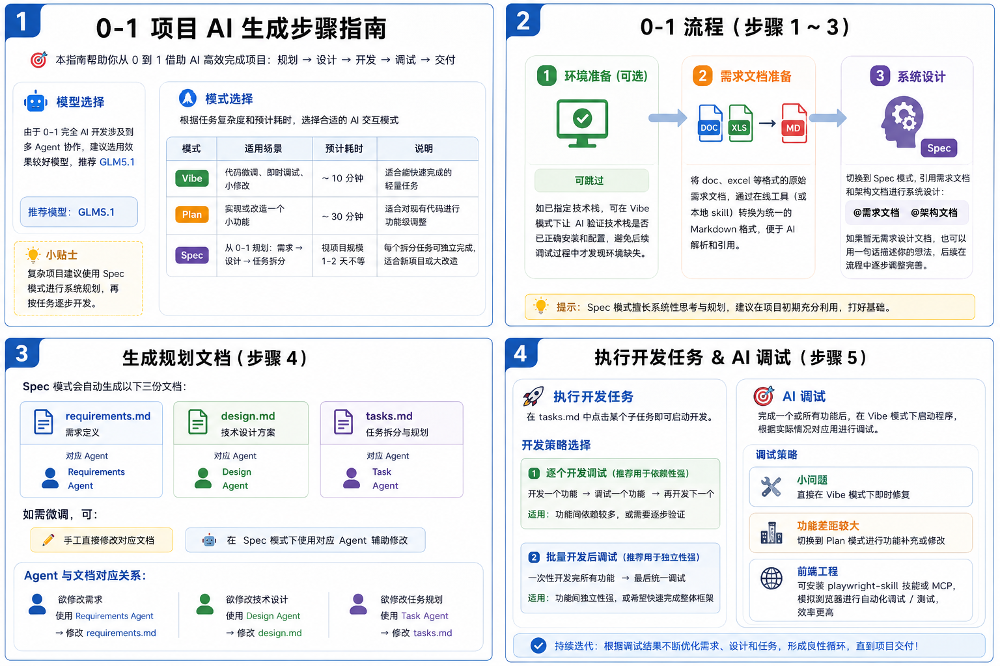
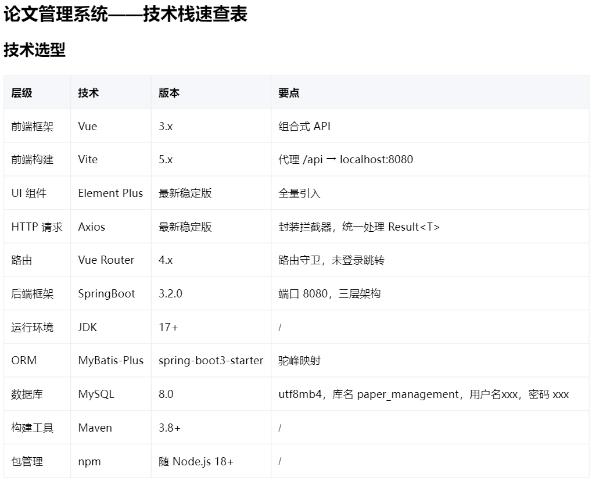
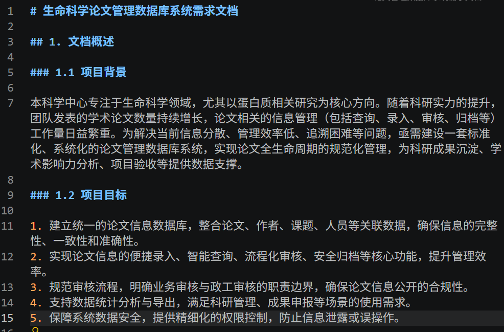
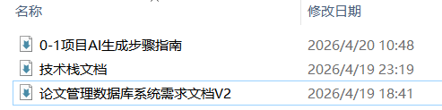

从零开始构建一个完整项目，听起来是个复杂工程。但如果有一个 AI 开发搭子帮你做需求分析、架构设计、任务拆分和代码实现呢？

CoStrict 是一个开源、灵活、支持多模型的 AI 编程工具，通过多 Agent 协作，帮你把"我有一个想法"变成"我有一份可运行的代码"。本文将以一个"论文管理系统"的实际项目为例，带你走完用 CoStrict 开发一个小型项目的完整流程，包含模型选择、编程模式选择、文档准备到测试上线的全流程。



## 一、开工前的两个关键选择

### 1. 选模型

0-1 开发涉及多 Agent 协作，对模型的综合能力要求较高。**建议使用评测表现效果较好的新模型，** 如DeepSeek V4、GLM5.1、Kimi K2.6等，它们在复杂任务规划、代码生成和上下文理解上表现更稳定。

### 2. 选模式

CoStrict 提供三种编程模式，按任务复杂度各取所需：

| **模式** | **适用场景** | **预计耗时** | **说明** |
|:---|:---|:---|:---|
| **Vibe** | 代码微调、即时调试、小修改 | ~10 分钟 | 适合能快速完成的轻量任务 |
| **Plan** | 实现或改造一个小功能 | ~30 分钟 | 适合对现有代码进行功能级调整 |
| **Spec** | 从 0-1 规划：需求 → 设计 → 任务拆分 | 视项目规模1-2天不等 | 每个拆分任务可独立完成，适合新项目或大改造 |

**简单粗暴的判断方式**：改几行代码选 Vibe，改一个功能选 Plan，从零做项目选 Spec。本次示例项目中，我们的 0-1 之旅从 Spec 模式开始。

## 二、五步走：从想法到可运行代码

### 步骤 1：环境准备（可选，但推荐）

如果你已经确定了技术栈（比如 Python + FastAPI + React），不妨先在 Vibe 模式下让 AI 检查一遍环境：

**"帮我检查一下 Python 3.11、Node.js 20 和 PostgreSQL 是否已正确安装"。**

这一步花 5 分钟，能省下后续调试时发现环境缺胳膊少腿的一小时。

在本次论文管理系统中，我们给CoStrict提供了一个技术栈文档\.md，让AI根据如下"技术选型"检查是否具备相应的运行环境。



### 步骤 2：需求文档 Markdown 化

原始需求散落在 Word、Excel、甚至聊天记录里。AI 读这些格式效率很低，所以需要先统一转为 **Markdown**。

- 用在线转换工具或 CoStrict 本地 skill 把 .docx / .xlsx 转成 .md
- 把产品草稿、功能清单也整理成 Markdown

**AI 最爱 Markdown文档，给它更好的输入，它给你更好的输出。**



### 步骤 3：Spec 模式启动系统设计

切换到 Spec 模式，IDE插件端在对话框中输入@（在CLI终端通过路径或md文档标题描述），让AI引用你的需求文档：

```
没有正式的需求文档怎么办？直接一句话描述想法也行：
```

没有正式的需求文档怎么办？直接一句话描述想法也行：

```
我想做一个论文管理系统，支持论文上传、自动分类、全文检索和团队协作
```

**Spec 模式的核心能力**：它会驱动多个 Agent 协同工作，自动完成从需求理解到设计再到任务拆分的全过程。你只需要告诉它"要什么"，不需要告诉它"怎么做"。

### 步骤 4：三份自动生成的规划文档

Spec 模式跑完后，.cospec/plan/changes/ 目录下会产出三份文档：

| **文档** | **负责 Agent** | **干什么的** |
|:---|:---|:---|
| requirements\.md | Requirements Agent | 把你的模糊描述变成结构化的功能需求 |
| design\.md | Design Agent | 选型建议、架构图、数据模型、API 设计 |
| tasks\.md | Task Agent | 把大项目拆成可逐个执行的小任务 |

**想微调？两种方式：**

- 想改哪儿直接**手动编辑**对应文档 —— 最直接
- 在 Spec 模式下用对应 Agent 辅助修改 —— 比如"帮我把用户模块的需求细化"

关键心智模型：**Agent 和文档是一一对应的**。想改需求找 Requirements Agent，想改设计找 Design Agent，想改任务拆解找 Task Agent。

### 步骤 5：执行开发任务

打开 tasks\.md，你会看到一列排好序的子任务。点击任意一个任务，CoStrict 就会启动对应 Agent 开始写代码。

**两种开发节奏，选一个适合你的：**

| **策略** | **做法** | **适合场景** |
|:---|:---|:---|
| **逐个开发 + 调试** | 做完一个，调试一个，再做下一个 | 功能耦合度高、需要逐步验证 |
| **批量开发后统一调试** | 一口气生成全部代码，最后集中调试 | 功能独立、想快速看到整体框架 |

我们的经验是：新手项目用**第一种，不怕慢，就怕乱**；熟练后可以批量起飞。

## 三、AI 调试的正确姿势

代码生成完了，项目跑起来了——然后崩了。很正常，调试才是开发的常态。

CoStrict 的调试策略分层：

- **小 bug**（报错明确、改一行就好的）：Vibe 模式下即时修，30 秒搞定
- **功能偏差/缺失**（生成的功能跟预期差得比较多）：切到 **Plan 模式**，重新规划再补上
- **前端 UI 问题**：安装 playwright-skill 或配置 Playwright MCP，让 AI 模拟浏览器自动调样式、测交互。（比肉眼找 CSS 问题快得多）

我们在项目中使用的测试skill来自[playwright-skill](https://github.com/lackeyjb/playwright-skill)，你也可以从[skills.sh](https://skills.sh)查看更多与playwright-skill有关的最佳实践。

## 四、附：一个真实案例的节奏参考

以本次"论文管理系统"项目为例，一个中等复杂度的 Web 应用的典型时间线：

这是我们给CoStrict的三个参考文档及最终效果：



> 以上文档已附在这里👉[文档下载](https://pan.quark.cn/s/279b7f8c1fcf)，可点击链接获取

<video src="../media/videos/ai-native-dev-project.mp4" controls></video>

## 五、总结

CoStrict 的 0-1 开发本质上是把"产品经理 → 架构师 → 拆任务 → 写代码 → 调试"这条传统流水线，压缩成一个你和 AI 的高效对话循环。

核心心法就三句话：

1. **Spec 定乾坤** — 花足够时间做好规划和设计，后面才不会跑偏
2. **分步验证** — 不确定时就逐个开发调试，不要盲目信任批量生成
3. **模式灵活切换** — Vibe 修小病，Plan 治大病，Spec 做手术

你现在手里有一个想做但还没开始的项目吗？打开CoStrict，切到 Spec 模式，把想法丢给它试试。
