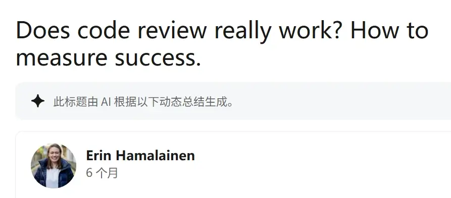
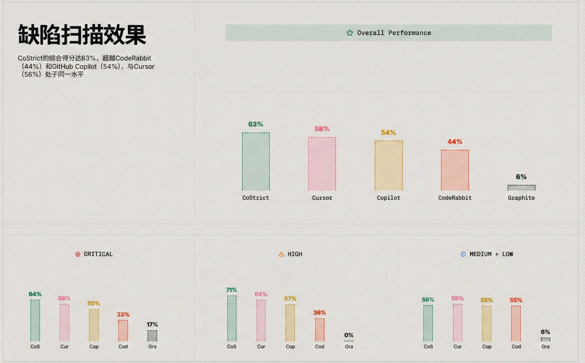
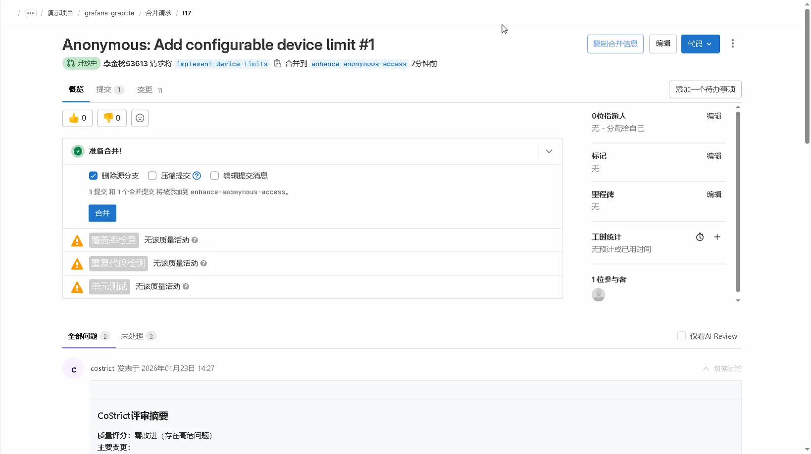
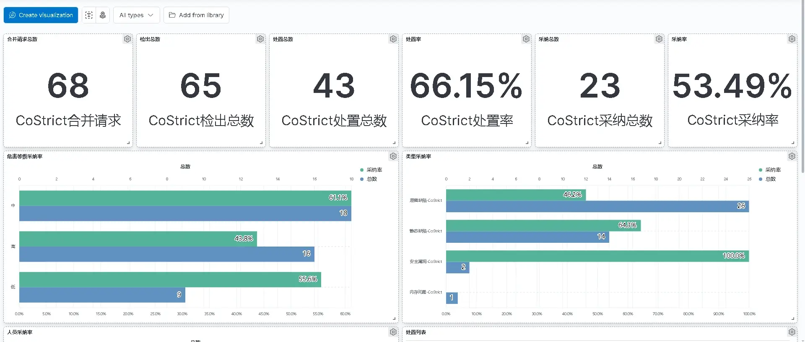

领英上有一个关于代码审查（CodeReview）的热门讨论：**CodeReview真的有用吗？如何衡量CodeReview是否成功？**

评论区的用户直抒胸臆，看法不一。

有人认为代码审查**可有可无**："传统的代码审查往往达不到预期效果，增加了流程负担，却没有带来太多价值，甚至会产生摩擦。过于直接的评论可能会让人觉得粗鲁，而过于礼貌的评论可能无法解决核心问题。"

也有人表示，代码审查**很重要**："代码审查的重要性，就像编辑对于记者一样。即使是经验丰富的程序员，也难免会犯一些低级错误，而代码审查可以帮助我们发现这些错误，提高代码质量，避免不必要的麻烦。代码审查之所以重要，是因为我们对自己写的代码太熟悉，反而容易忽略其中的问题。"

对许多企业来说，代码审查是CI/CD流程中不可或缺的一环。代码审查即检查代码质量，传统做法是，让一名或多名未参与编写代码的人Review代码，发现代码中的问题，为质量把关，保证团队代码的一致性和可靠性。

这种做法的弊端是流程长、效果因人而异，高度依赖团队成员的知识水平和互信程度。随着AI Agent在开发领域的大规模应用，AI生成的代码数量呈现指数级增长。然而，AI生成代码的速度越快，审查队列越长，CodeReview常常成为开发流水线上的"瓶颈"，拖慢发布周期。

在此背景下，CoStrict打造了一个为AI Agent而生CodeReview系统，拥有**安全漏洞扫描、故障排除、AI代码修复**等功能，适配多种代码扫描场景，就像一位**随时在线、经验丰富**的编程搭子，无缝切入你的工作流，让代码质量"看得见"。

### **Greptile综合得分达63%，超越CodeRabbit**

**在 Greptile 代码审查领域的权威公开评测集中，CoStrict CodeReview系统最新的综合得分达63%，超越CodeRabbit（44%）和GitHub Copilot（54%），与Cursor（58%）处于同一水平。** 更令人欣慰的是，在实际试点团队中，系统发现的**51%缺陷建议被深信服研发人员采纳，** 其中，高价值缺陷里逻辑缺陷类采纳率达到**57%**，安全漏洞类采纳率达到**56%**。CodeReview系统不仅给的建议多，而且给的准。

CoStrict CodeReview系统是怎么做到上述效果的？

1. **全面的智能体扫描**：采用智能体驱动扫描的方案，覆盖四类缺陷，包括逻辑缺陷、安全漏洞、静态缺陷和内存问题，同时引入专门的验证反思流程，兼顾检出率和准确率。

2. **深度语义理解**：结合语言服务器协议（LSP）工具，能够更智能地对代码库进行高精度的语义解析，为跨文件的调用链追踪和影响面分析提供可靠的基础。

3. **完整的缺陷溯源**：提供完整的缺陷分析溯源与影响面评估，系统可追溯缺陷根因并分析其传播链与潜在影响，同时提供可执行的修改建议与参考实现，显著提升评审效率与缺陷修复准确率。

### 两种方式均可触发，无缝融入你的开发流程

CoStrict CodeReview系统设计的第一原则是：**不打断你的工作流**。它支持两种方式触发代码扫描，以适应不同的开发流程。

**方式一：开发期间，即时反馈编码问题**

通过CoStrict插件，在IDE里写代码时就能实时扫描。无论是刚写好的片段、当前文件，还是本次的所有变更，点一下就能看到专业建议。**问题更早发现的话，修复成本更低**。

操作步骤：

1. 打开VS Code/JetBrains IDE；

2. 打开CoStrict插件；

3. 在文件浏览器中右键点击文件，选择 CoStrict > Code Review 即可对整个文件进行代码审查；你也可以选中函数/代码块/多文件，右键 > CoStrict > Code Review。

[codereview-1.23.mp4](../media/videos/codereview-1.23.mp4)

**方式二：CI/CD期间，合并前自动守护代码质量**

CoStrict的CodeReview能力还可以与GitLab等平台深度集成（无需改造原有系统）。每次创建合并请求时，系统自动运行全面扫描，生成清晰的审查报告。**无需人工触发，质量关卡自动生效**。

操作步骤：

1. 配置 Token

2. 配置 Webhook

3. 创建合并请求，一段时间后就能合并请求页面看到扫描的问题

### 企业级功能：支持自定义规则，提供质量面板

考虑到没有两个团队的技术栈和规范完全一致，CoStrict支持按需定义扫描规则，让系统更灵活、更开放。在仓库中添加简单的配置文件，你就能：

- 启用或禁用特定检查规则

- 定义团队特有的编码规范

- 集成内部安全扫描工具

- 持续沉淀团队的最佳实践

这种做法让系统成为**团队知识库的承载者**，而不是强加一套通用标准用于不同的场景。

质量不能只靠感觉。CoStrict还提供直观的**代码质量看板**，团队和项目负责人可以一目了然地看到如下问题：

- **全量缺陷分布：** 哪些模块问题最多？

- **缺陷类型统计：** 是逻辑问题多还是安全问题多？

- **修复进度与趋势：** 质量是在改善还是恶化？

- **团队对比**（可选）：健康度横向参考

这些设计让质量改进从"口号"变成**可衡量、可追踪、可改进**的具体行动。

使用这套系统后，团队反馈最强烈的几点变化是：

1. **新人上手更快**：即时反馈就像有位导师随时指点，避免了低级错误反复出现；

2. **资深开发更专注**：机械性检查交给系统，人可以聚焦架构设计和核心逻辑；

3. **团队知识沉淀**：自定义规则让优秀实践固化下来，不随人员变动而流失。

CoStrict CodeReview系统能够在开发者开发阶段、提交代码或创建合并请求阶段，扫描出代码安全问题，提供全面的审核意见，帮助团队保持高质量的代码标准。我们认为，好的工程工具不应该给开发者增加负担，而是能**提升开发者的幸福感和效率**。最好的工具是那些**融入流程、让人几乎感觉不到存在**的工具。我们的目标不是创造一个"代码挑错机器"，而是成为开发团队的一位**理解上下文、懂得团队规范、永远耐心**的代码伙伴。它在你写代码时无声提醒，在提交变更时全面检查，在团队协作时保持标准一致，在项目演进中守护质量底线，最终让开发者能更专注地创造价值。

如果你也在寻找更智能、更集成的代码质量解决方案，欢迎一起交流探讨。
