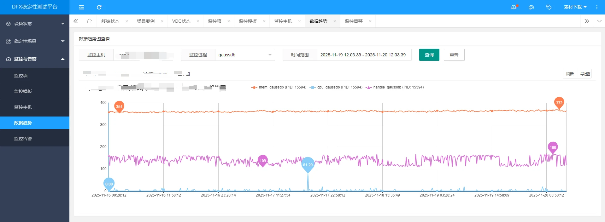

本期案例由 **杨龙（YL）** 贡献。

不得不感慨，AI Coding时代人均程序员，DFX的测试人员杨龙用AI工具CoStrict，2小时搞定了一个专业级数据可视化功能，直接让测试平台的易用性拉满。原来，他发现DFX稳定性测试平台缺少数据趋势图查看功能，于是几句指令交给CoStrict，一个可视化、交互性和体验感俱佳的新功能就火速上线。

快来围观他的高效秘籍！

### 1、案例背景

在我们的DFX稳定性测试平台中，需要添加一个数据趋势图查看功能，让用户能够直观地查看监控数据的变化趋势。原始问题是平台已有监控功能，但缺乏数据可视化展示，用户无法直观地了解监控指标的历史变化情况。我们需要基于现有的LayuiUI框架，集成ECharts图表库，实现一个数据趋势图查看页面。

### 2、案例实操

#### 2.1 提供的上下文

AI在开始任务前，先了解了项目的整体结构：

- 项目是基于Flask的Web应用，前端使用LayuiUI框架
- 已有监控相关的页面和功能，如监控项管理、监控主机管理等
- 项目已集成ECharts图表库，在console.js中有使用示例

然后AI根据任务检索并查看了以下关键文件来了解项目结构：

- `web/static/html/index.html` — 主页面，了解菜单结构
- `web/static/html/monitor/monitor_item_list.html` — 监控项列表页面，了解现有监控功能的实现
- `web/static/layuiadmin/modules/console.js` — 控制台模块，了解ECharts的使用方式
- `web/static/html/home/console.html` — 控制台页面，了解页面布局

#### 2.2 提示词

我的提示词非常简单：

**"我想用layuiUI编码支持数据趋势图查看"**

#### 2.3 具体操作步骤

**创建前端页面：**

- 创建了 `web/static/html/monitor/data_trend_chart.html` 文件
- 设计了包含搜索条件区域、图表展示区域和数据表格区域的页面布局
- 使用LayuiUI的表单组件实现监控主机、监控项和时间范围的选择
- 集成ECharts图表库，实现数据趋势图的展示
- 添加了刷新和导出功能按钮

**创建后端API：**

- 创建了 `controller/monitorconfig/chartdata.py` 文件
- 实现了三个API接口：`/chartdata/host/list`（获取监控主机列表）、`/chartdata/item/list`（获取监控项列表）、`/chartdata/data/trend`（获取数据趋势数据）
- 在API中生成了模拟数据，包括CPU使用率、内存使用率、网络流量和磁盘IO等指标

**注册API路由：**

- 修改了 `web/web.py` 文件
- 导入新创建的 `chartdata_bp`
- 注册了蓝图路由，设置URL前缀为 `/chartdata`

**更新前端API调用：**

- 修改了 `web/static/html/monitor/data_trend_chart.html` 中的API URL
- 将API路径调整为正确的后端路径

**添加菜单项：**

- 修改了 `web/static/html/index.html` 文件
- 在"监控与告警"菜单下添加了"数据趋势"菜单项

### 3、案例效果

#### 3.1 功能完成情况

任务完成后，实现了以下功能：

- **用户可以通过主菜单访问数据趋势图页面**
- **可以选择监控主机和监控项进行数据查看**
- **支持自定义时间范围查询**
- **提供了多指标数据可视化展示（CPU使用率、内存使用率、网络流量、磁盘IO）**
- **支持图表缩放、数据点查看、图表导出等功能**
- **包含详细数据表格，方便查看具体数值**

#### 3.2 相比之前的改进

之前平台只有基础的监控功能，用户无法直观地查看数据变化趋势。现在：

- **可视化提升：** 从纯数据列表变为直观的图表展示
- **交互性增强：** 支持时间范围选择、数据缩放等交互操作
- **功能完善：** 增加了数据导出功能，方便用户进行进一步分析
- **用户体验优化：** 页面布局合理，操作流程简单直观

### 4、案例总结

通过这个案例，我深刻体会到AI辅助编程的效率和优势。AI能够快速理解项目结构，生成符合项目规范的代码，大大减少了开发时间。特别是在处理复杂的前端页面和后端API时，AI能够提供完整的解决方案，包括错误处理和边界条件考虑。

AI辅助编程不仅提高了开发效率，还能帮助开发者学习新的技术和最佳实践。通过与AI的交互，我能够快速了解LayuiUI和ECharts的使用方法，并将其应用到实际项目中。

希望大家能够积极尝试AI辅助编程，将其应用到日常开发工作中。在使用过程中，要注意提供清晰的上下文和需求描述，这样AI才能更好地理解我们的意图，提供更准确的解决方案。同时，也欢迎大家分享自己的AI辅助编程案例，让我们一起学习和进步，共同提高开发效率和代码质量。

记住，AI是我们的助手，而不是替代者。在使用AI生成代码后，我们仍然需要进行代码审查和测试，确保代码的质量和安全性。让我们善用AI工具，提升开发效率，创造更多价值！

如果你也有好的使用案例，欢迎分享出来，让我们一起探索AI辅助编程的最佳实践，共同提升团队的开发效率和代码质量。我们也会赠送额外的2000 Credits，供你体验更加丰富的模型资源哦~

投稿邮箱：zgsm@sangfor.com.cn
