近期，Anthropic、OpenAI、Cursor 和Stripe 等团队在技术文章提到了同一个概念——**Harness（约束）**，并从不同角度形成了近似共识：**模型本身的能力已不再是核心瓶颈，围绕模型构建的工程系统才是决定 Agent 实际表现的关键因素。**

CoStrict是一款开源的企业级 AI 编程助手，致力于帮助开发团队完成从需求理解到编码交付的完整闭环。自去年发布严肃编程Strict模式以来，我们沉淀的诸多实践与Harness 理念契合，本文将具体拆解CoStrict实践Harness Engineering提升编码能力的具体做法，并展示相关效果，欢迎大家在评论区讨论交流。

在正式介绍前，我们先介绍Harness。

## 什么是 Harness Engineering？

Harness（束具、驾驭）一词源自缰绳、马鞍、马衔等马术装备，用于引导一匹强大但不可预测的动物朝着正确方向前进。想象你骑着一匹烈马。马跑得快，但不知道该往哪儿跑，也不知道什么时候该停。你需要缰绳、马鞍、马衔等，这些统称为 Harness。

对应到 AI Agent：

- **马** = AI 模型，能力强但方向不确定
- **束具** = 基础设施，包括约束、护栏和反馈回路
- **骑手** = 人类工程师，提供方向和监督

Harness Engineering 就是为AI Agent设计这套束具的工程，它的目标是**构建一套完整的约束、引导和验证机制，使 Agent 在复杂任务中保持正确的方向和稳定的表现。**

### 为什么需要Harness？

大语言模型（LLM）有三个"硬伤"：

**1. 记忆有限**——上下文窗口是稀缺资源，装不下所有信息。

**2. 输出不确定**——同一个问题可能得到不同回答，长任务中容易跑偏。

**3. 任务拆解弱**——面对大型项目，不知道从何下手。

Prompt Engineering 解决不了这些问题。你可以在提示词里写"请高质量完成"，但 Agent 该跑偏还是跑偏，我们需要的是系统性的工程手段。

## Harness Engineering的三大支柱

Context Engineering（上下文工程）、Architectural Constraints（架构约束）和 Entropy Management（熵管理）构成了 Harness Engineering 的核心框架。Context Engineering 确保 Agent 在每个决策时刻都拥有精确且充分的信息；Architectural Constraints 通过结构化的边界将 Agent 行为限定在可控范围内；Entropy Management 则通过反馈回路和防御机制持续对抗系统熵增，维持长程任务的秩序与稳定。

### 1. Context Engineering（上下文工程）

核心问题：Agent 在正确的时间能看到正确的信息吗？

对 Agent 而言，不在上下文窗口里的信息等于不存在。上下文工程要解决的问题分两类：静态上下文（规范文档、配置文件、知识库链接）和动态上下文（日志、监控、任务状态、工作空间结构）。关键不是"塞进去就行"，而是精准、相关、及时。

### 2. Architectural Constraints（架构约束）

核心问题：Agent 被允许做什么？

传统做法是在 Prompt 里写"请按 JSON 格式输出"。Harness 做法是定义严格的 JSON Schema 加自动校验器，不合格直接打回重来。

约束的价值在于：当 Agent 面对无限可能时，它会消耗大量 token 探索各种路径；当 Harness 划定边界后，Agent 能更快收敛到正确答案。

### 3. Entropy Management（熵管理）

核心问题：上下文会不会越来越"脏"？

随着任务推进，上下文会积累熵：文档和实际代码对不上、命名风格在不同模块间分裂、过时信息悄然堆积。熵管理不是事后清理，而是每次写入时同步验证——新内容是否与已有规范冲突？被替代的旧信息是否已清理？交叉引用是否仍然有效？

## CoStrict 的 Harness 实践

CoStrict 是一款开源的企业级 AI 编程助手，在生产环境中的实测数据：单次任务稳定运行 1000+ Steps，端到端执行无中断、不跑偏，万级文件项目困难任务在一小时内完成，工具调用成功率 95.7% 以上，长程任务中几乎不触发上下文压缩。以下将围绕 Harness Engineering 的三大支柱逐一展示CoStrict的系统设计实践，并在最后通过实际运行数据验证这些设计的有效性。

### Context Engineering 实践

#### 1.上下文压缩作为最后防线

很多系统把上下文压缩当常规操作。在 Harness Engineering 的视角下，上下文压缩本质上意味着信息损失。因此，CoStrict把压缩定位为兜底机制，只有在实在塞不下时才触发。我们的做法是在上游把上下文管理做得足够精细，让压缩几乎用不上。实测 1000+ Step 的任务中，压缩机制几乎从未触发。

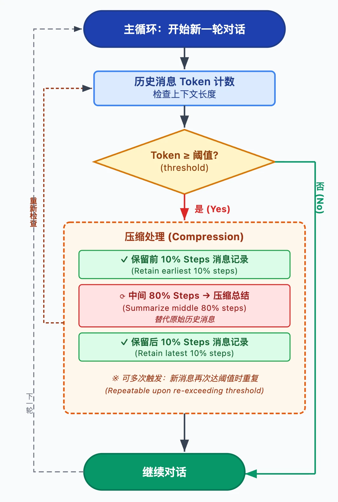

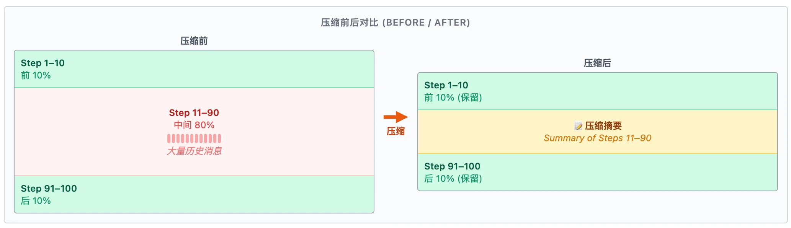

#### 2. Agent-Git 上下文共享

多 Agent 协作有个难题：后面的 Agent 怎么知道前面的干了什么？

CoStrict 的做法是给 Agent 建一个独立的 Git 仓库（.agent-git），与项目原始的 Git 仓库完全隔离。

Agent 启动时，系统会为当前代码状态创建一个初始快照作为基准。此后，每个 Agent 通过唯一的 author 标识提交自己的工作历史，后续 Agent 可通过 agent-git log 查看完整的提交记录链。

这一设计如同真实开发团队的协作方式：**新成员加入项目时，可以通过 commit log 快速了解项目的变更历史，必要时再深入查看某次提交的具体 diff。** 所有 Agent 的修改记录与项目真实的 Git 历史完全隔离，不会污染版本记录。同时，系统支持 revert 操作，确保代码变更的安全性和可追溯性。

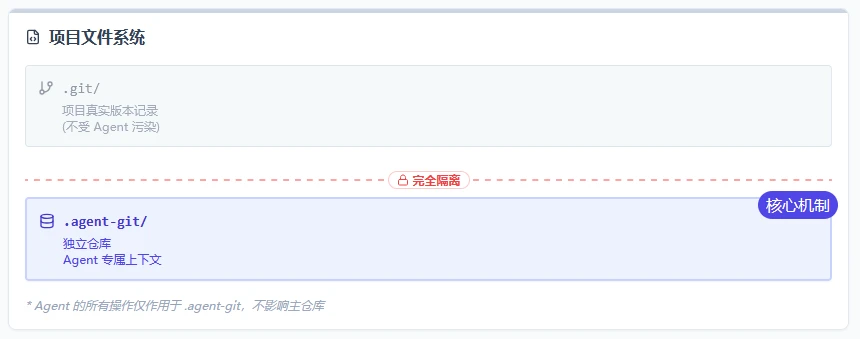

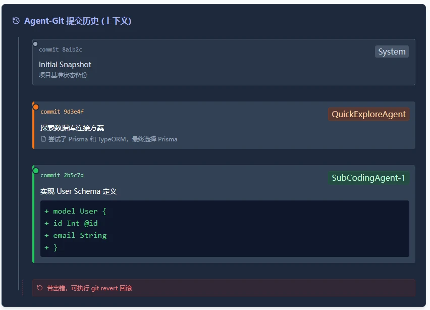

#### 3. Memory Bank 经验共享

在多 Agent 架构中，子 Agent 运行在隔离上下文中，这意味着前序Agent踩过的坑，后续 Agent可能还会再踩。

Memory Bank 的作用是把可复用的经验抽离出来，变成项目级知识资产。某个 Agent 解决了一个棘手问题，写入 Memory Bank，后续 Agent 自动获得这份经验。个体经验沉淀为共享知识，系统越用越顺手。

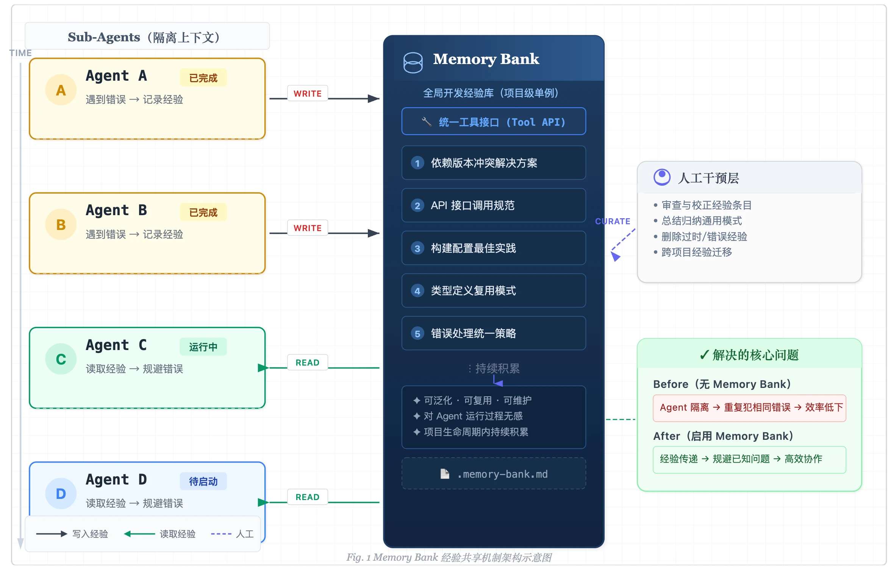

#### 4. 工具结果拦截

上下文窗口是 Agent 最宝贵的资源之一。如果一次不当的搜索操作返回了数万行无用结果，不仅浪费上下文空间，还可能直接触发压缩兜底，造成前序有价值信息的丢失。CoStrict采用了一种 **"入口防御"策略**，在低价值信息进入上下文之前就进行拦截。

具体而言，系统会在工具执行前后进行多级检查：判断搜索结果的行数和 token 数是否超过合理范围，检测搜索关键词是否过于宽泛（如 def、class 等几乎会匹配所有代码的关键词）。对于不满足质量标准的搜索请求，系统会及早拦截工具执行或屏蔽返回结果，同时给出更精确的搜索建议引导 Agent 重新搜索。

这一机制的价值是双重的：它既保护了上下文的信噪比，避免偶发性的超长工具结果一次性消耗大量上下文空间；也提升了每次搜索操作的精确性，引导 Agent 形成更高效的信息检索习惯。

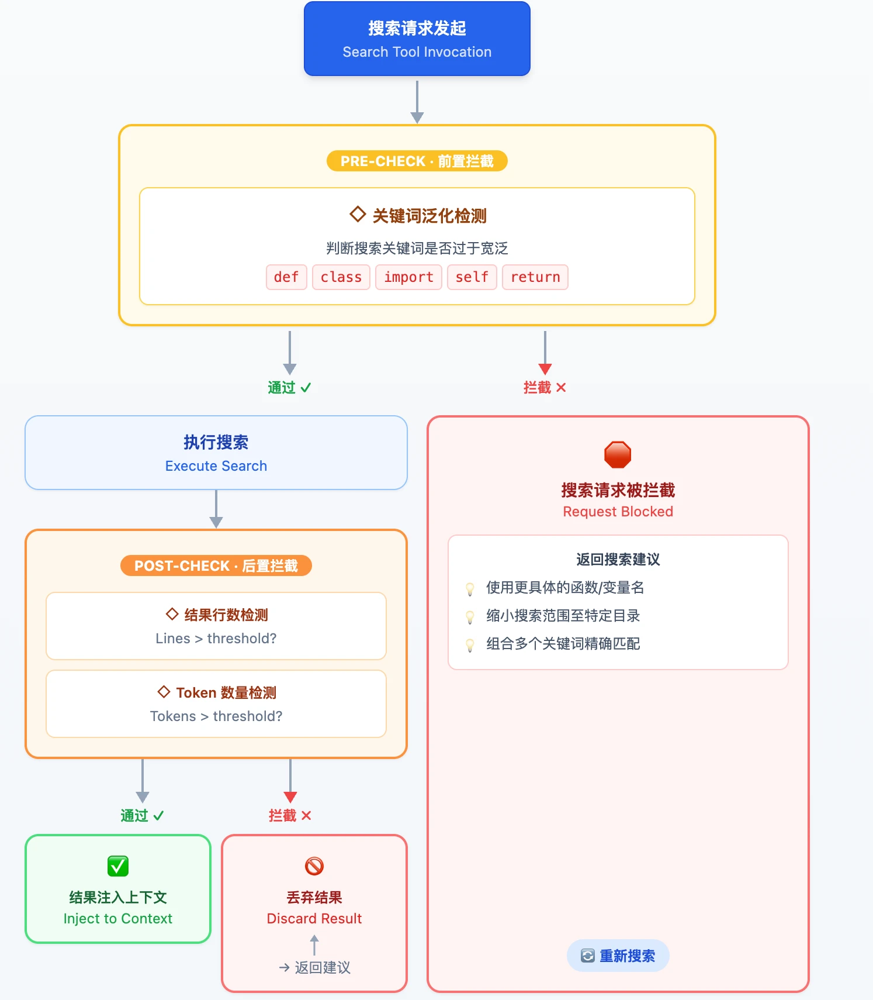

### Architectural Constraints 实践

#### 1. 主/子 Agent 分离架构

CoStrict 把**规划**和**执行**分开：

| **Agent 角色**  | **职责**             | **能否改代码**           |
| --------------- | -------------------- | ------------------------ |
| Proposal Agent  | 需求分析、任务规划   | 禁止                     |
| TaskCheck Agent | 验证任务清单可执行性 | 禁止                     |
| Coding Agent    | 编码阶段管理         | 禁止（只拆分任务）       |
| SubCoding Agent | 唯一的代码修改者     | 独占                     |
| Fix Agent       | 后处理修复           | 禁止（委托给 SubCoding） |

这种设计职责清晰，规划者不能越权执行；上下文隔离，主 Agent 不被子任务细节干扰；过程可追溯，每一步都有明确责任归属。

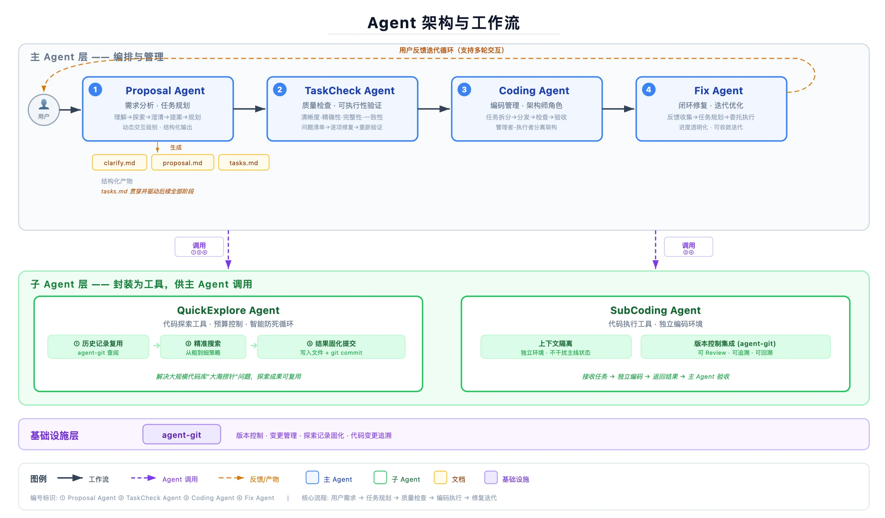

#### 2. 预算控制机制

无约束的 Agent 会陷入"过度探索"——反复调工具、钻牛角尖、停不下来。CoStrict 的做法是给每个 Agent 分配工具调用预算，每次调用后告知剩余次数，使其具备资源意识。当预算耗尽时，系统直接拦截后续工具执行并屏蔽工具列表，强制要求 Agent 基于已获取的信息进行总结并结束任务。这种做法从根本上杜绝了 Agent 无限制运行的可能性，引导 Agent 行为逐渐收敛。

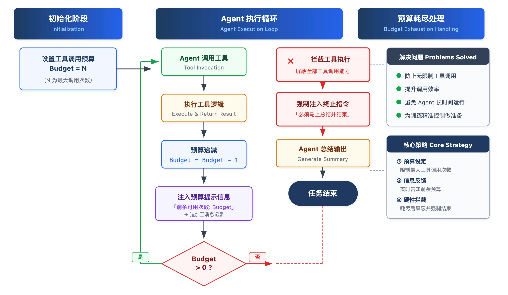

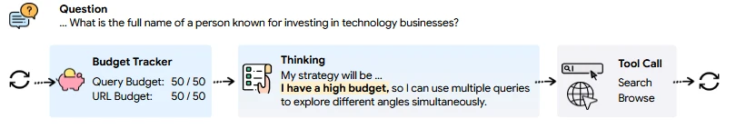

#### 3. 工作流阶段约束

CoStrict将完整的开发流程拆成多个结构化、可验证的阶段，每个阶段有明确的输入输出规范，阶段之间通过结构化产物形成契约关系。

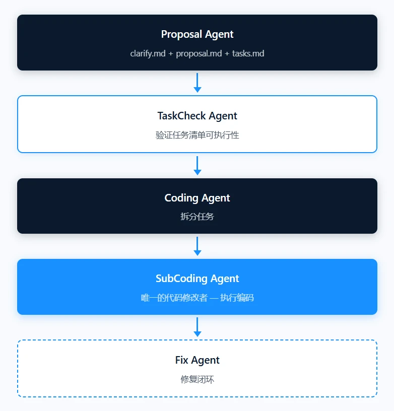

这种设计使得每个阶段都有明确的质量门禁，结构化产物充当阶段间的契约。整个工作流支持迭代收敛而非一次性完成——如果某个阶段的产出不满足下游要求，系统可以精确地回溯到该阶段进行修正。

### Entropy Management 实践

#### 1. 原地重试与消息清理

LLM 偶尔会出错：返回空内容、只说话不执行、参数格式错误。如果这些无效输出留在上下文里，会持续干扰后续推理。CoStrict 的处理方式是，检测到无效回复后原地重试，重试前保存快照，失败回复不进入历史记录，直到获得有效输出。

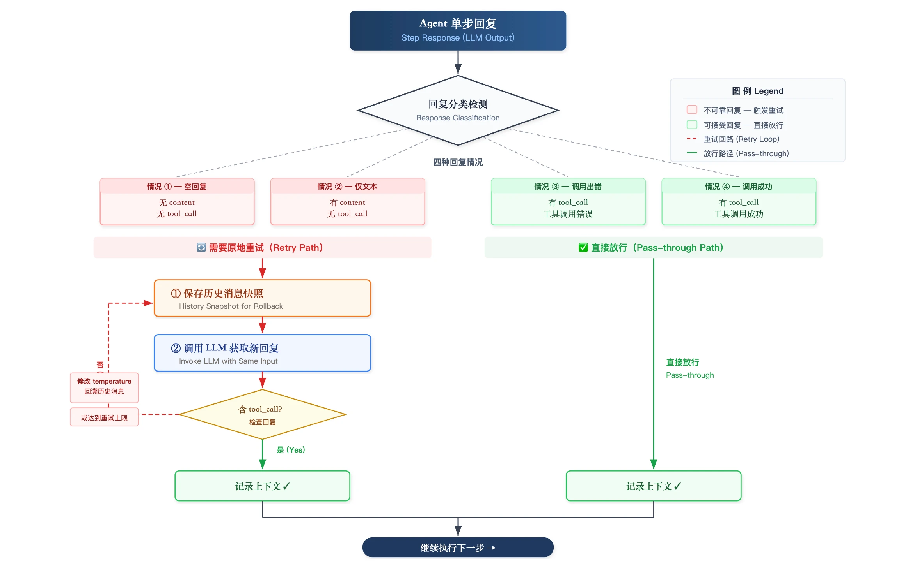

#### 2. 死循环预防

Agent 陷入死循环是常见的失效模式：反复用相同参数调相同工具。

CoStrict 设了两级防御来应对这一问题。第一级是重复工具监测：检测到连续相同调用就拒绝执行，并给出告警。第二级是强制反思机制：检测到 Agent 无法自行跳出循环时，屏蔽所有工具，只保留"Sequential Thinking"思考工具，强制 Agent 停下来回顾历史行为。实测中，经过一轮强制反思，Agent 通常能找到替代方案并跳出循环。

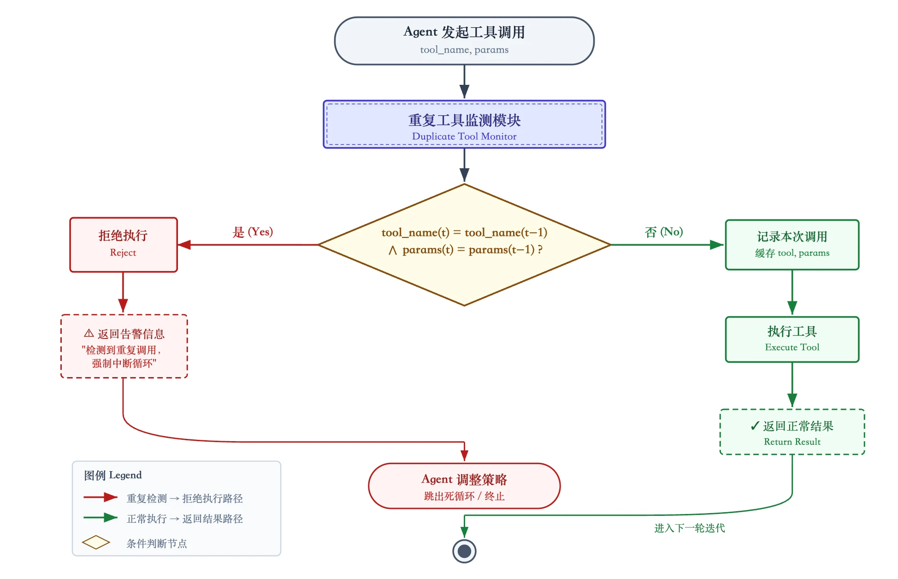

#### 3. 测试驱动迭代收敛

Harness Engineering 强调 Agent 的行为应当向收敛方向发展，而非无限制迭代。CoStrict 实现了三层测试反馈和最多两轮 CI 反馈循环，防止边际收益递减。

| **层级**      | **内容**                          | **耗时** |
| ------------- | --------------------------------- | -------- |
| 本地快速测试  | lint + 单元测试                   | < 5 秒   |
| CI 选择性测试 | 从 300 万+ 用例中智能选择相关子集 | 按需     |
| 自动修复      | 预设常见失败场景的修复方案        | 即时     |

CoStrict 引入了Agentic TDD（基于智能体的测试驱动开发）工作流，将Agent与传统软件工程流水线深度结合，实现一个无需人工干预的闭环开发过程。**代码必须依次通过以下三个阶段的检验，才能最终完成开发。**

**第一阶段：LSP 语法检查（静态分析）**

代码生成后，首先进入基于语言服务协议（LSP）的静态分析环节。这一阶段主要负责排查基础的语法错误、变量未定义或类型不匹配等语义诊断问题。如果检查通过，代码将进入下一阶段；如果发现语法错误，系统会立即将错误信息发送给 Fix Agent，由其生成修正代码并重新注入该环节，直到语法完全合规。

**第二阶段：项目编译（构建与依赖解析）**

通过语法检查的代码随后进入完整的项目编译流程。这一阶段旨在解决更宏观的系统级问题，如依赖包缺失、环境约束冲突或链接错误。一旦发生编译错误，Fix Agent 会接管编译日志，分析并输出修正代码或编译配置修复方案，反复尝试直至项目成功构建。

**第三阶段：测试验证（动态逻辑校验）**

编译成功的项目将运行单元测试与接口测试。这是最核心的业务逻辑验证环节。如果出现断言失败，说明代码虽然能跑通，但行为不符合预期。此时，Fix Agent 会根据详细的测试失败报告，精准定位缺陷并修正业务逻辑。只有当所有测试用例全部通过时，整个 TDD 流程才宣告圆满结束。

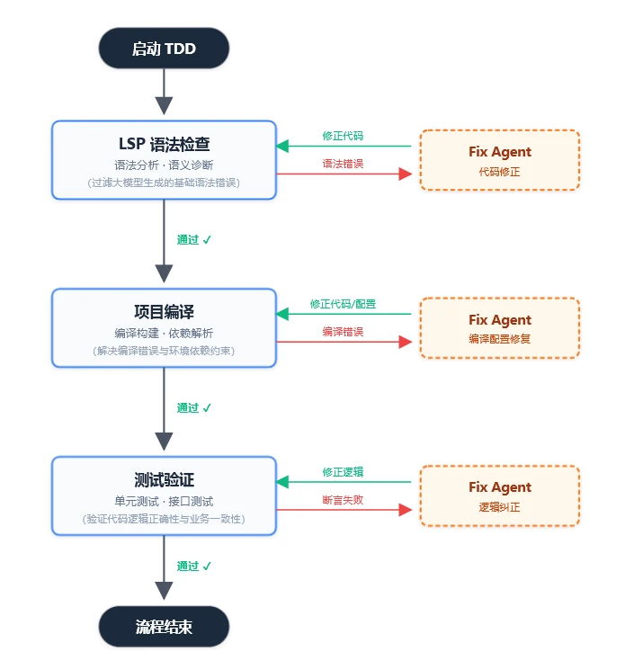

## 实测数据

为了验证上述 Harness Engineering 实践的有效性，我们在两个不同规模的代码仓库上进行了端到端的任务执行测试。APEX-feat1 是一个中小型项目，VT-feat3 则是一个万级文件规模的企业级项目。

两个任务均在约 40 分钟内完成了从需求理解到编码交付的完整闭环。APEX-feat1 的总 Step 数超过 1100，VT-feat3 超过 1300，两者的工具调用成功率均达到 95.7% 以上。Fix 迭代轮数方面，APEX-feat1 经历了 3 轮迭代，VT-feat3 仅需 1 轮。这组数据表明，即使面对规模差异显著的项目，系统的多 Agent 协作工作流都能稳定运行，并在可预期的时间和步数范围内完成任务。

| **指标**       | **APEX-feat1（中小项目）** | **VT-feat3（万级文件项目）** |
| -------------- | -------------------------- | ---------------------------- |
| 任务耗时       | 约 40 分钟                 | 约 40 分钟                   |
| 总 Step 数     | 1100+                      | 1300+                        |
| Fix 迭代轮数   | 3 轮                       | 1 轮                         |
| 工具调用成功率 | 95.7%+                     | 95.7%+                       |

同时，我们对共计 35,133 次 Bash 命令调用的执行耗时进行了统计分析。结果显示，89.5% 的命令在 0.5 秒内完成，98.4% 在 2 秒内完成，中位耗时仅为 0.05 秒。这组数据表明 Bash 工具的执行表现高度稳定，绝大多数调用能够提供快速且一致的响应，执行耗时的可预期性很强。少量超过 10 秒的调用经排查与编译大型项目、下载外部依赖、大段文件写入等特定操作相关，并非工具本身的性能波动。

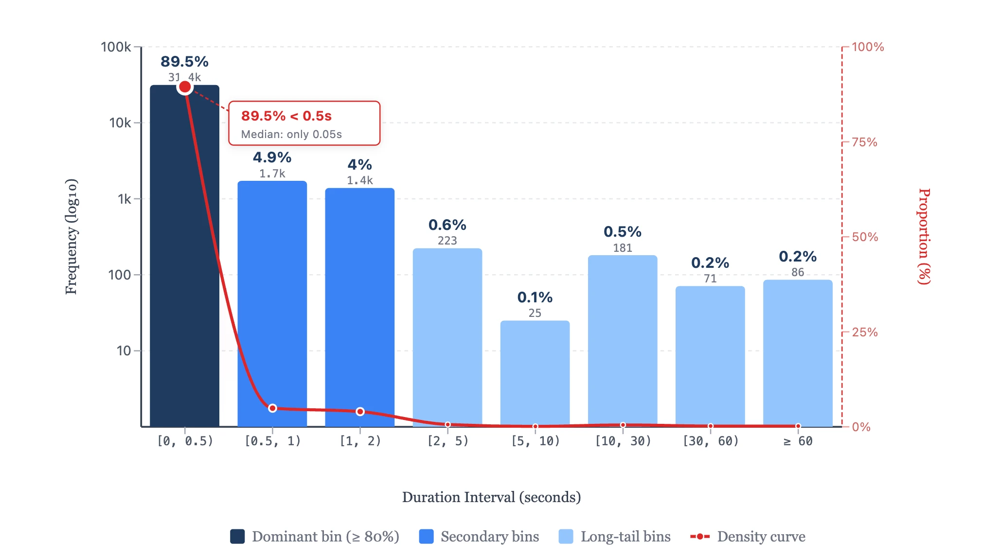

各 Agent 的耗时分布揭示了系统的一些有趣特征。Proposal Agent 在两个项目上的耗时差异最为显著——APEX-feat1 仅用 7.87 分钟，而 VT-feat3 则花费了 21.19 分钟。这一差异忠实地反映了两个项目在代码规模和复杂度上的差距，说明 Proposal Agent 的需求分析深度能够自适应地匹配项目复杂度。TaskCheck Agent 在两个案例中的耗时分别为 3.12 分钟和 2.84 分钟，仅占总耗时的 7% 至 12%，表明这一质量检查环节以极小的时间成本换取了任务清单质量的显著提升。Coding Agent 和 Fix Agent 在两个项目上的表现则相当稳定，耗时波动不大，分别在 10--11 分钟和 6--8 分钟的区间内。

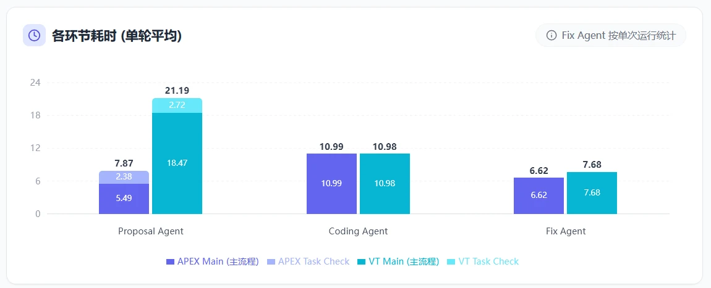

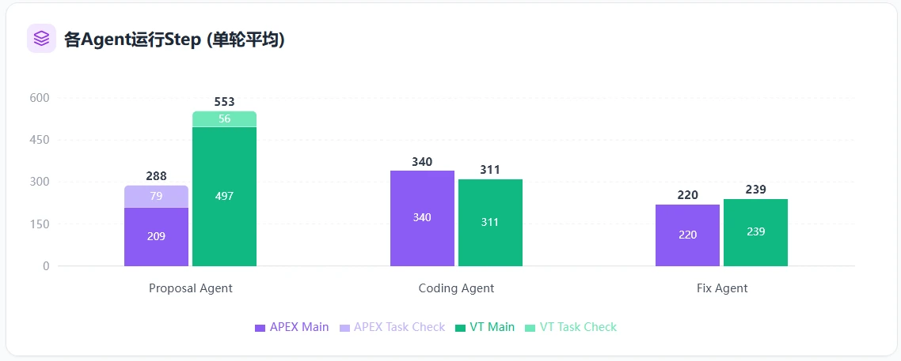

## 关键结论

通过实测，我们通过以下四点验证了 **Harness 机制**在**Costrict**中的有效性：

- **长程任务稳定性：** 1000+ Step 的执行验证了 Harness 机制的有效性，Agent 能够稳定运行而不崩溃或跑偏。
- **迭代收敛能力：** Fix 迭代轮数少（1-3 轮），表明任务规划质量高，子 Agent 执行准确。
- **工具链可靠性：** 95.7%+ 的成功率支撑自动化工作流，子 Agent 工具调用成功率接近 100%。
- **上下文管理有效性：** 长程任务几乎不触发上下文压缩兜底，表明上下文工程机制设计合理。

## 我们的观察

### 工程师的新角色

Harness Engineering 也将改变软件工程师的日常工作内涵。在传统开发模式下，工程师的核心工作是编写代码，调试对象是代码逻辑，评审重点是实现方案，测试工作围绕用例编写展开，文档则主要服务于人类读者的理解。而在 Harness Engineering 模式下，工程师的核心工作变为**设计 Agent 的运行环境**，调试对象变为 Agent 的行为模式，评审重点转向 Agent 输出质量与 Harness 机制的有效性，测试工作演变为设计测试策略供 Agent 自动化执行，文档维护则升级为构建机器可读的上下文基础设施。

工程师的工作分化为两个相互交织的层面——构建环境与管理 Agent。前者关注的是如何打造一套高质量的 Harness 基础设施，后者则关注如何在运行时观测、引导和修正 Agent 的行为。

| **维度** | **传统模式** | **Harness 模式**             |
| -------- | ------------ | ---------------------------- |
| 核心工作 | 编写代码     | 设计 Agent 运行环境          |
| 调试对象 | 代码逻辑     | Agent 行为模式               |
| 评审重点 | 实现方案     | Agent 输出质量               |
| 测试工作 | 编写用例     | 设计自动化测试策略           |
| 文档维护 | 给人看       | 构建机器可读的上下文基础设施 |

### Harness可能成为护城河

AI 编程工具正在从"能用"走向"好用"，从实验室中的原型走向生产环境中的工具。在这一演进过程中，Harness Engineering 将成为区分玩具与产品的关键分水岭。原始模型能力的差距正在缩小，而 Harness 质量的差距才刚刚开始显现。因此，**那些率先构建起高质量 Harness 体系的团队，将在工程效率上获得难以复制的结构性优势。**

Harness Engineering 汲取了软件架构中关于模块化、关注点分离和防御性设计的经验，借鉴了团队管理中关于职责划分、流程约束和反馈机制的智慧，同时融入了上下文工程这一全新领域的创新。随着 Agent 能力的持续增强和应用场景的不断扩展，Harness Engineering 的重要性只会与日俱增。因为**越强大的 Agent，越需要精心设计的缰绳来确保其力量被可靠地引向正确的方向。**
