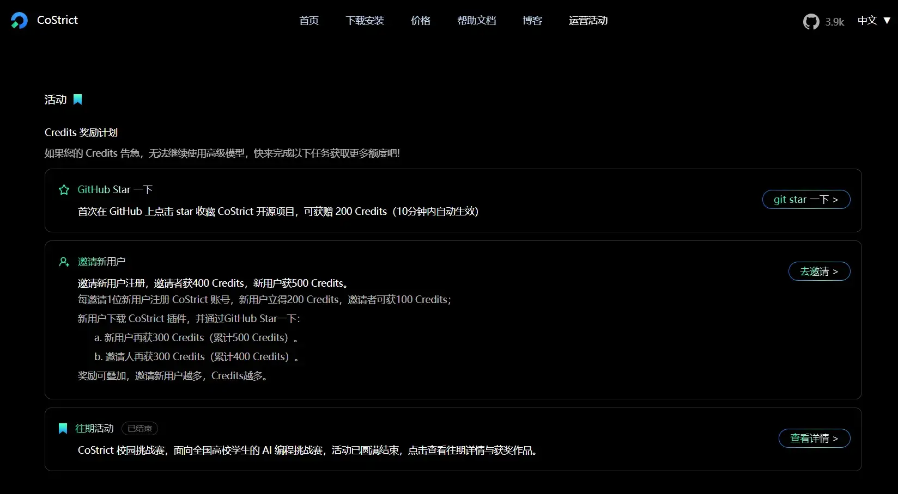
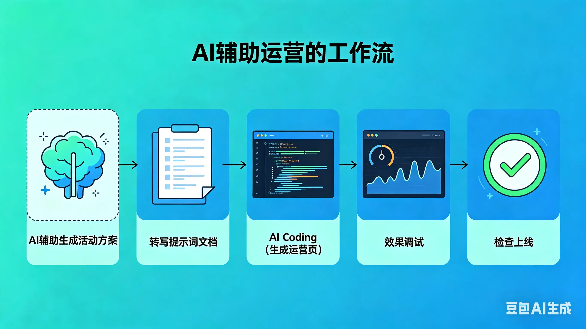
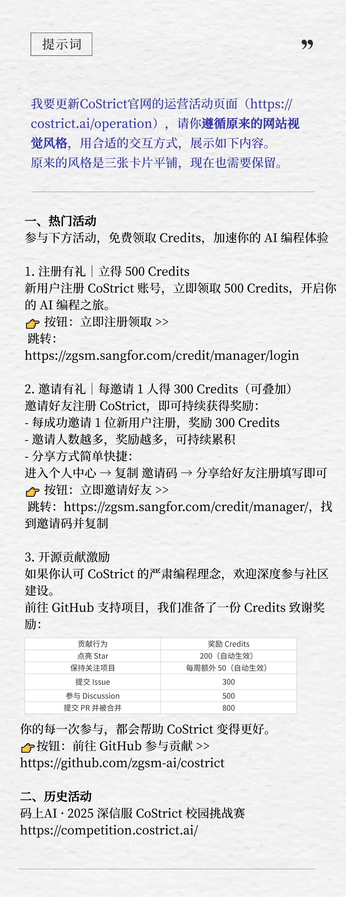

近期，CoStrict团队的运营Connie用CoStrict CLI写了一个运营活动的交互页面，体验丝滑，且与CoStrict官网风格十分一致。

作为非研发人员，她花了1个小时做出了一个达到上线要求的页面，并获得了团队交互设计师、前端工程师的一致点赞，以下是她的分享。

最近，我用AI Coding工具 CoStrict CLI 写了一个运营活动的交互页面，效果有点惊艳，想分享给大家，也谈谈我们团队的"AI辅助运营工作流"。

[operation_page.mp4](../media/videos/operation_page.mp4)

（待上线的页面，非最终版）

这个活动计划放在CoStrict官网（https://costrict.ai）上，旨在提高产品的拉新成功率和社区活跃度。和先前的版本相比，它降低了拉新的门槛，增加了对开源贡献的激励。活动内容更丰富，交互形式却更简洁了。

（此前的页面）

从策划活动方案到生成前端页面，没有反复调试，我一个人花了大概1个小时来完成。其中，Coding时间大约只有30多分钟（含等待模型输出的时间）。

页面做出来后，我发给了交互设计师、前端工程师以及团队里的其他同学看，获得了大家的一致点赞（"鼓励"），还有同事希望我帮他完善另一个页面的效果。

这个页面有两大模块：热门活动和历史活动。其中，热门活动是重点，需要高优展示；历史活动则需要弱化展示。热门活动又分为三个版本：注册有礼、邀请有礼和开源贡献激励，在这3个模块中，我需要让用户直观看到**他能获得多少Credits，需要做什么，规则是什么。**

以往做这样一个页面，至少需要三个人的配合：

- 运营负责构思活动方案和细节，提出需求；
- 交互设计师负责出视觉稿，把需求拆解为可视化功能，用视觉语言把文字转化成更容易被大家读懂的内容；
- 前端工程师再通过代码把交互的视觉稿变成大家可访问、可点击的页面，适配网页版、移动端等。

这次，只有我1个人，用1个多小时，干完了三个人的工作。这是一种与以往不同的工作流：运营在AI的加持下，最大限度完成工作的自闭环，再交付给专业人士把关和上线。

看到这里，大家不会以为我要说的是：从现在开始，团队可以减少交互和前端了吧？

并非如此，我给CoStrict的提示词里有一句很重要：**"请你遵循原来的网站视觉风格"。**

原来的视觉风格是什么？它来自设计师最初的创意与随后的精雕细琢。离开了它，这个页面从视觉上失去了灵魂。

现实情况中，设计师们常常需要深入调研、反复打磨，才能形成原创的视觉风格。前端工程师也要思考不同的实现方案，从中选择更适合的来实现。他们的专业把关很重要。这次我用AI完成的，只是交互和前端工作内容中的冰山一角，页面内容不多，所以用AI能很好地实现意图。如果要做复杂的交互逻辑和复杂的功能，仍然少不了专业人士的拆解与设计，为质量负责。

完成这个页面后，我问了前端同事一个问题："客观来说，我把做好的HTML发给你，真的能省时间么，还是很鸡肋？"

他回答："用AI生成活动页面，你那边可以直接看到效果，反复调试，省去了我们来回沟通的成本。而我这边只需要做迁移然后测试移动端的效果，的确节省了不少时间。不过，现在的前端项目架构不会全部是HTML，需要适配当前项目的架构。"

从我们最近的实践效果来看，AI在完成静态页面、原型demo方面效果很好。它的一大价值是，**清晰地传递需求，让团队内部"沟通、对齐"的效率快速提升。**

从前我们用文档、用会议对齐需求；如今，我们用**页面和原型**直接展示想要实现的功能，从这个角度看，AI被用在了正确的地方。

另一方面，虽然AI可以扩大个体的能力边界，但对组织而言，边界很重要。我作为运营完成这个页面，更重要的是为了"节目效果"，向大家展示CoStrict CLI 的能力，**为产品推广服务。**

我思考的出发点是，**用更有新意的方式推广产品，**把时间用到创新上，而不是假装成为前端工程师和交互设计师，取代某些工作。

我想，AI的出现就是让我们有更多时间思考，简化一些繁琐的工作，让每个人有机会跳出当前工作内容，从其他视角看问题，拥有更多输入，从而更好地投入到创新之中。

如果你也对这个项目感兴趣，欢迎试用CoStrict CLI，加入我们的交流群，和我们一起探讨如何在组织内用AI提效。

**说明：本次我使用的是CoStrictMax模型，以下是初版提示词。**

我要更新CoStrict官网的运营活动页面（https://costrict.ai/operation），请你遵循原来的网站视觉风格，用合适的交互方式，展示如下内容。

原来的风格是三张卡片平铺，现在也需要保留。

**一、热门活动**

参与下方活动，免费领取 Credits，加速你的 AI 编程体验

**1. 注册有礼｜立得 500 Credits**

新用户注册 CoStrict 账号，立即领取 500 Credits，开启你的 AI 编程之旅。

👉 按钮：立即注册领取 >>

跳转：https://zgsm.sangfor.com/credit/manager/login

**2. 邀请有礼｜每邀请 1 人得 300 Credits（可叠加）**

邀请好友注册 CoStrict，即可持续获得奖励：

- 每成功邀请 1 位新用户注册，奖励 300 Credits
- 邀请人数越多，奖励越多，可持续累积
- 分享方式简单快捷：

进入个人中心 → 复制 邀请码 → 分享给好友注册填写即可

👉 按钮：立即邀请好友 >>

跳转：https://zgsm.sangfor.com/credit/manager/，找到邀请码并复制

**3. 开源贡献激励**

如果你认可 CoStrict 的严肃编程理念，欢迎深度参与社区建设。

前往 GitHub 支持项目，我们准备了一份 Credits 致谢奖励：

| 贡献行为 | 奖励 Credits |
| -------- | ------------ |
| 点亮 Star | 200（自动生效） |
| 保持关注项目（持续 Star） | 每周额外 50（自动生效） |
| 提交 Issue | 300 |
| 参与 Discussion | 500 |
| 提交 PR 并被合并 | 800 |

你的每一次参与，都会帮助 CoStrict 变得更好。

👉 按钮：前往 GitHub 参与贡献 >> https://github.com/zgsm-ai/costrict

**二、历史活动**

码上AI · 2025 深信服 CoStrict 校园挑战赛
[码上AI·2025深信服CoStrict校园挑战赛](https://competition.costrict.ai/)

END
