大家好！我是Connie，一个不写代码的CoStrict运营。最近我用CoStrict写了一个给公众号文章排版的skill，并将该skill用到了上周发布的文章《斯坦福推荐阅读：高质量规范是新型源代码|他山之石》之中，完成了"**skill创建——安装——使用——调优**"的全过程。

以下是详细使用过程。这个skill让我在深度体验CoStrict产品能力之余，见识到**AI在改善非程序员群体工作效率方面的巨大潜力**。

如果你是一位CoStrict新用户，可通过如下内容**了解CoStrict Skill创建和使用方式。** 如果你是CoStrict重度用户，欢迎给我们投稿，**分享改善工作的宝藏skill和工作流，** 我们将给每位认真分享的投稿者发放5000 Credits。（具体规则详见文末）

### 从自身需求出发，创建专属skill

一直以来，运营都需要在公众号文章排版上花费不少时间。大标题小标题、引文、字体、行间距、字间距、图片版式......一篇排版细致的公众号需要考虑很多，这些东西既费时间，又看不见产出。虽然市面上有不少第三方编辑器，但它们常常只能解决一部分问题，无法解决全部。遇到结构复杂、图文、代码片段夹杂的技术类文章，只能唉声长叹，然后一头扎进文档堆里。

GitHub上也有不少开源的公众号文章排版skills，但他们多半基于程序员更爱的markdown格式来做排版，而不是广大运营常用的在线文档、word等格式，对运营不够友好，上手成本高。

基于上述原因，我决定用AI Coding工具CoStrict自建运营视角的排版Skill，在解决自身需求的同时，也记录产品的真实使用体验。

#### Step1 把word文档给到CoStrict，生成适合微信公众号阅读的html

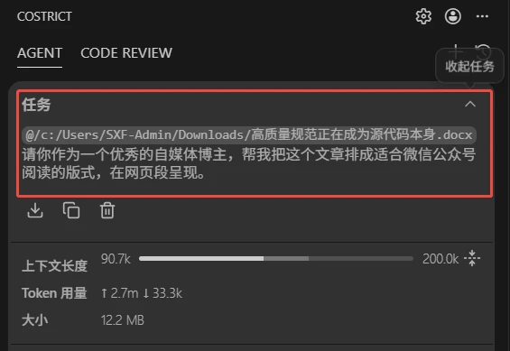

- 我没有直接让CoStrict生成skill，而是先让它把文章排版，让我看看效果。这样做的好处是，当我们脑子并没有"一个好用的skill应该长啥样"的画像时，可以先把最终效果想象出来，让AI逐步实现。

几分钟内，CoStrict完成了这篇4000多字的长文排版。

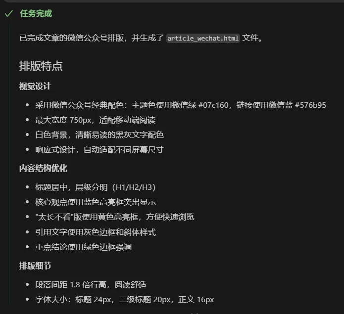

- 初始效果并未令人满意。由于我并未指定专属配色和边框样式，AI发挥的余地太大，页面有黄色、绿色、蓝色、灰色，花花绿绿，不符合我们的品牌配色。通过几轮对话，我让CoStrict继续修改，直到满意为止。

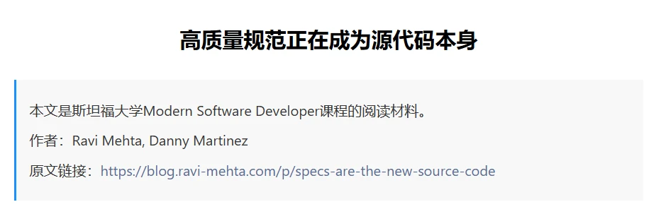

（图：排版截图）

#### Step2 将文章的版式规范沉淀为skill

- 我继续通过对话的方式向CoStrict提出需求：**请帮我把上述排版信息转化为一个通用的skill.md，以便后续使用。**

其实到这一步时，我并不确定CoStrict有没有生成skill的能力，但在看过多个skills之后，我发现skill其实只是一个markdown文档，本质仍是提示词。既然是文本信息，那就有了我操作的空间。

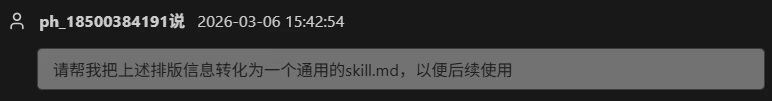

- 参考官方文档中Skill的编写要求（https://docs.costrict.ai/cli/config/skills），我给CoStrict复制了skill的格式和规则信息，并给CoStrict提供了一个skill示例作为参考，要求它写出合格的skill。

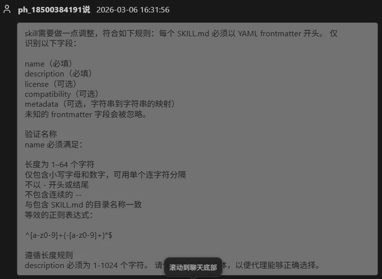

这是CoStrict生成的skill结果，看起来很规范。

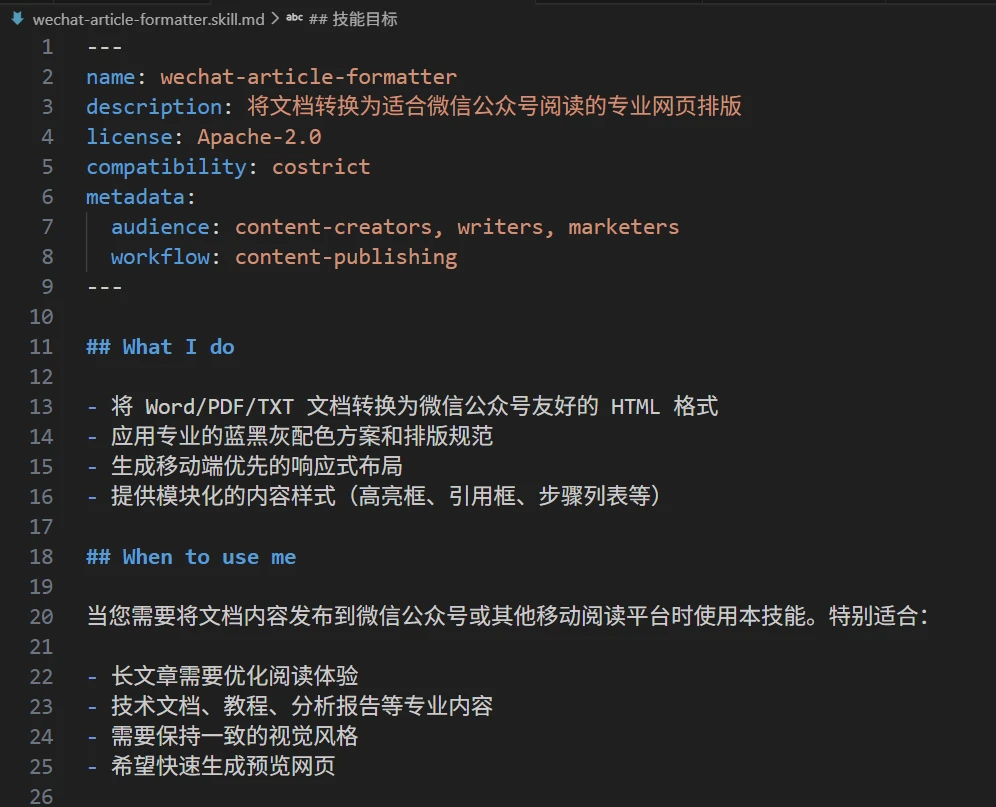

到这里，skill创建工作已经完成。值得一提的是，由于我更熟悉VS Code插件端的图形化界面，所以上述skill全程在插件端完成。事实上，CLI端也完全支持skill编写。

### 向先进团队学习，到CoStrict CLI中使用自建Skill

CoStrict CLI是我们最新推出的命令行工具，兼容适配Claude Code、OpenCode的各种skills。专业人士都在CLI端使用skills，我决定向他们学习，到CLI使用skills。如果刚刚创建的skill可以在CoStrict CLI 跑通，也意味着它也有机会反向输出给Claude Code、OpenCode用户，还能起到传播推广的作用。

#### Step1 到文件目录中配置全局可用Skill

配置skill的方式很简单，在安装目录下找到.config/costrict文件，新建skills文件夹，再新建了一个wechat-article-formatter文件夹（**注：文件夹名称，需与此前在插件端生成的skill.md文档中name保持一致。**）

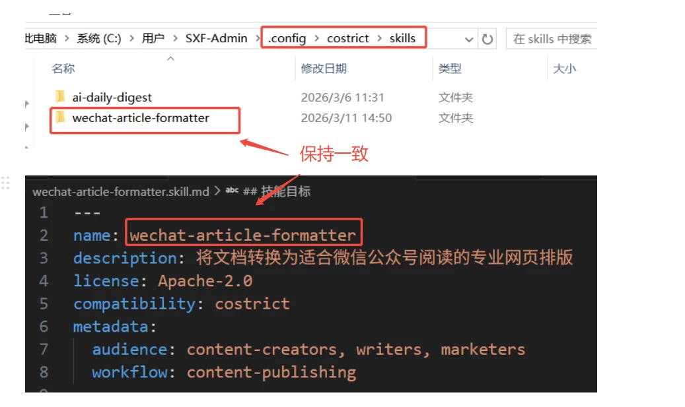

进入文件夹，将此前生成的skill文档（.md格式）复制到此处，并将文档名称修改为SKILL。

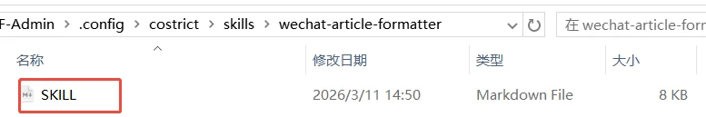

需要提醒的是，如果发现某个 skill 没有按预期出现在可用列表中，可以从以下几个方面进行排查：

- **文件名检查：** 确保文件名是 SKILL.md，**全大写。**
- **Frontmatter检查：** 确认SKILL.md 文件中包含了必需的name和description字段。
- **名称唯一性：** 检查所有扫描路径下是否存在同名的skill。skill名称必须是唯一的，如果出现冲突，加载行为可能不确定。
- **权限检查：** 检查 costrict.json 中的权限配置，deny 规则会直接将 skill从列表中隐藏。

通过这些检查，通常可以快速定位并解决skill 加载失败的问题。

#### Step2 检查skill是否加载成功

- CoStrict CLI启动时，它会自动扫描所有预定路径，发现可用的skill。只需要在**CoStrict CLI对话框中输入"skill"**，CoStrict会自动告诉我它有哪些skills可用。可以看到，wechat-article-formatter这个skill已经成功加载。

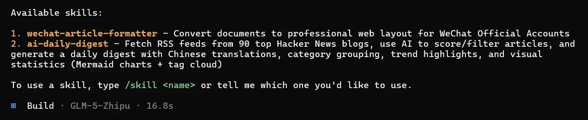

- 告诉CoStrict文档标题是什么，让它进行排版。

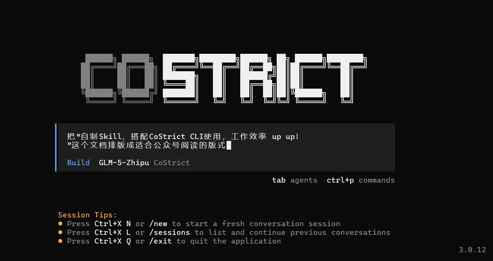

- 接下来，在打开的html网页中，通过ctrl+A和ctrl+C即可把排版后的文章复制到微信公众号编辑器里。由于微信公众号编辑器有自己的一套"规则"，会对粘贴进来的内容进行"清洗"和"改造"，我们粘贴到公众号编辑器里可能会出现样式丢失问题。为了避免这一情况，我们需要提前告诉CoStrict微信公众号的特点，创建微信兼容的版本。可以看到，下方排版保留了样式信息。

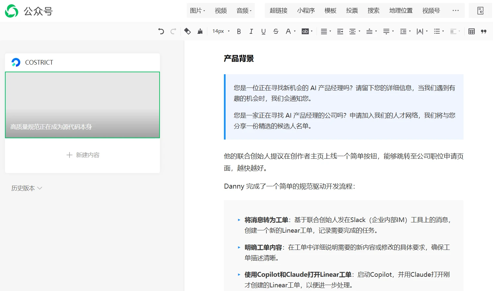

#### Step3 好用的Skill需要多次打磨与反复沉淀

创造skill的过程也像创造一个新的产品：需求要足够明确，规范要足够准确（如字号多少、什么颜色、用什么字体，兼容什么编辑器），创造它的过程仍少不了反复的调试与修改。

不过，这些调试是值得的。一次创造，多次使用，如果你也对这个skill感兴趣，在github搜索zgsm-ai/costrict并收藏，我们正在打造CoStrict Skill Market，后续也会分享更多精选的知识合集。

### 心态第一：Don't be Afraid of Coding

吴恩达在他的"How to Build Your Career in AI"一书中提到，几百年以前，社会并未将识字作为一项必备的生存技能，如今，我们默认人们能读会写。也许未来有一天，人们也会把使用AI写代码当做一种基本素养。**Coding AI is the new literacy（AI编程是一种新素养）。**

无论是程序员还是非程序员，敢于直面AI带来的变化就已经赢了一半。当写代码成了一种基本素养，懂代码的程序员赢在了起跑线上，而不懂代码的非程序员也无需担忧，工具总会朝着更有利于使用的方向进化。大模型并非凭空出现，依旧是为了服务人类，AI很强，我们也不弱，当我们把心态切换到驾驭AI之上，Skill也好，小龙虾（OpenClaw)也罢，都只是AI进程中的产物，是为我们所用的工具罢了。

（完）

**🎁 有奖征集 | 分享你的Skill，赢5000 Credits！**

你在使用CoStrict, Claude Code或OpenCode时，是否写过特别好用的Skill？或是总结了一套独家的实践心得？

现在，分享你的Skils，并把你的实践整理成文章，投稿至 zgsm@sangfor.com.cn。一旦被采纳，你的作品将发布在 CoStrict 公众号上，让更多人看见，同时你将获得 5000 Credits（有效期3个月）作为奖励！期待你的分享，    一起让 CoStrict 正在建设的 Skills Market 更强大
