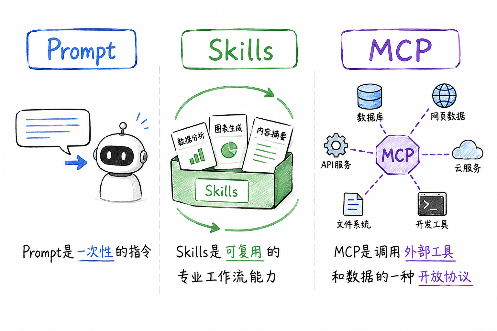

# 一文读懂 Skills：AI Native 团队值得安装的 10 类热门 Skills

2025 年 10 月，Anthropic 正式发布 Claude Skills 机制。两个月后，Agent Skills 作为开放标准进一步推出，迅速获得 OpenAI、GitHub、VS Code、Cursor 等主流平台的支持。如今，Skills 已经成为 AI Agent 的"能力插件层"，并逐渐发展为 AI Native 研发体系的重要基础设施。

本文将系统性介绍 Skill 的基本概念，按研发场景分别推荐 10 类值得安装的热门 Skills，并附上安装和编写指南，**帮你把 Skills 从单点工具变成"团队能力插件"。**

## 一、什么是 Skills？

根据 Anthropic 官方定义，Skills 是一组**可被 Agent 动态加载的能力包**，包含 instructions、metadata、scripts、templates 等资源。

从工程视角理解：**Skills 是模块化的能力扩展包**。每个 Skill 以文件夹形式存在，内含一份核心的 SKILL\.md 文件（包含 YAML 元数据和 Markdown 指令），以及可选的脚本、模板和参考资源。Agent 会根据对话上下文自动判断是否需要加载某个 Skill，无需用户手动指定。

一个完整的 Skill 通常会包含如下模块：

```
my-skill/
├── SKILL.md # 必需：元数据 + 指令，定义 Skill 的用途、触发条件、执行步骤 
├── scripts/ # 可选：可执行代码
├── references/ # 可选：文档，规范、知识库、最佳实践
├── assets/ # 可选：模板、资源
├── examples/ # 可选：示例
└── ... # 其他文件或目录
```

**Skill 与 Prompt、MCP 之间的区别**是一个常见疑问。简而言之：Prompt 是一次性指令，每次输入符合当前需求的会话；MCP 是一种开放协议，关注的是 AI 如何以统一方式调用外部工具和数据；而 Skill 是可复用的工作流，教 Agent 如何完整处理特定工作，将执行方法、工具调用方式及相关知识封装为一个完整的能力扩展包。



Skills 之所以能高效运行，关键在于它的**渐进式披露**设计。该机制将信息分为三个层次，Agent 按需逐步加载：

- **第一层（元数据）**：Agent 启动时仅加载所有已安装 Skill 的名称和简短描述，几乎不占用上下文窗口。这一层提供"何时使用该 Skill"的线索；
- **第二层（技能主体）**：当 Agent 判断某个 Skill 与当前任务相关时，才会加载完整的 SKILL\.md 内容，获取详细指令和示例；
- **第三层（附加资源）**：仅在必要时加载或执行 Skill 文件夹中的脚本和参考文档，避免将无关内容塞入上下文。

这种设计使得单个 Skill 可以包含海量信息而不受上下文窗口限制，同时大幅减少重复 Prompt 的编写工作。

## 二、热门 Skills 分类推荐

CoStrict 在 GitHub 上开源的 everything-ai-coding 项目（<https://zgsm-ai.github.io/everything-ai-coding/#/browse?type=skill>）收录了超过 1800 个可复用 Agent Skills，覆盖前端、后端、测试、AI/ML 等多个领域。你可以复制 skill 名称到 skill 市场下载对应 skill。

### 2.1 文档与办公自动化

在日常研发中，文档处理（Word、PDF、Excel、PPT）往往占据大量时间。Anthropic 官方推出的文档 Skills 系列（docx、xlsx、pdf、pptx）是使用最广泛的生产力工具之一。

| 热门 skill | 用途描述 | 地址 |
|---|---|---|
| **docx** | 支持程序化创建、读取、编辑和操作 Word 文档，包括追踪修改、批注和格式化功能，适合自动生成技术文档或报告 | <https://github.com/anthropics/skills/tree/main/skills/docx> |
| **xlsx** | 提供电子表格的创建、数据分析和格式化能力，可用于自动生成数据报表 | <https://github.com/anthropics/skills/tree/main/skills/xlsx> |
| **pdf** | 封装了 PDF 合并、拆分、文本提取等代码脚本，让 Agent 具备完整的 PDF 处理能力 | <https://github.com/anthropics/skills/tree/main/skills/pdf> |
| **pptx** | 支持从文本大纲自动生成演示文稿，适合快速制作技术分享或汇报材料 | <https://github.com/anthropics/skills/tree/main/skills/pptx> |

这类 Skills 的核心价值在于**将重复性文档工作标准化**——你只需提供内容要点，Agent 即可按照预设格式和规范输出成品。

### 2.2 Spec / PRD / 架构设计

目前，Spec 类 Skills 正在快速流行，它们能够帮助开发者将模糊需求转化为结构化、可执行、适合 Agent 协作的工程任务，解决 AI "直接写代码但缺少规划"的问题。典型能力包括 PRD 生成、技术方案设计、RFC 编写、架构拆解、Task Planning、模块边界定义等。

| 热门 skill | 用途描述 |
|---|---|
| **PRD Generator** | 目前 Claude Skills 社区中最典型的 PRD 类 Skill 之一，支持从产品想法自动生成结构化 PRD，包含用户故事、功能拆解、技术约束、验收标准与风险分析等内容，适用于 AI Coding、独立开发与 Agent Workflow 场景 |
| **create-prd（pm-skills）** | GitHub 上热门的产品管理 Skill 集合，包含 Discovery、Roadmap、Release Planning 等完整产品流程能力，不仅生成 PRD，还能够完成需求优先级分析、任务拆解与研发协同，是一种 Product Operating System 式的工作流能力 |
| **spec-driven-development** | 强调"先 Spec、后 Coding"的 AI Native 开发模式，自动生成功能规格说明、模块边界、数据流与执行步骤，并驱动后续 Agent 按规范实现代码，适合大型项目和复杂工程 |
| **task-breakdown-planner** | 负责将复杂需求拆解为可并行执行的任务图（Task Graph），支持模块划分、依赖关系分析、上下文隔离和多 Agent 协同执行，是当前多智能体 AI Coding 中增长最快的一类 Skills |
| **architecture-review** | 面向企业研发场景的架构评审 Skill，可自动分析微服务边界、DDD 分层、API 设计、Repository Pattern 与技术债风险，帮助团队保持长期架构一致性与可维护性 |
| **api-schema-design** | 专注于 API 与数据结构设计，支持 RESTful / GraphQL Schema 自动生成、接口规范检查、字段命名统一以及契约式开发，适用于前后端协同与大型平台开发 |
| **manus-style-planning** | 借鉴 Manus 等 Agent 系统的长任务管理方法，通过 task_plan\.md、progress\.md、findings\.md 等持续约束 Agent 执行过程，避免上下文漂移、目标遗忘与长链路失控问题 |
| **multi-agent-orchestrator** | 面向 AI Native Software Engineering 的多智能体编排 Skill，可协调 Planner、Coder、Reviewer、Tester 等多个 Agent 协同工作，实现任务分发、执行跟踪与结果汇总，逐渐成为复杂 AI Coding 系统的重要基础设施 |

### 2.3 前端设计与开发

前端设计类 Skills 可帮助开发者摆脱"AI 风"千篇一律的界面风格，生成具有独特设计品质的产品。

| 热门 skill | 用途描述 |
|---|---|
| **frontend-design（Anthropic）** | 最值得安装的 Skill 之一，提供极简、复古、未来感、野兽派等多种美学方向选择，注重排版、色彩、动效和空间布局，达到生产级设计标准，适用于 React 组件、HTML/CSS 布局和完整 Web 应用的构建 |
| **fullstack-developer** | 精通 Web 开发的全栈专家，覆盖 React/Next.js + Node.js + PostgreSQL/MongoDB |
| **cache-components（Vercel）** | Next.js 缓存组件最佳实践，自动生成带缓存语法的数据组件 |

### 2.4 测试

测试类 Skills 能显著降低编写和维护测试用例的成本：

| skill | 解释 |
|---|---|
| **webapp-testing（Anthropic）** | 基于 Playwright 的 Web 应用测试工具集，支持前端功能验证、UI 行为调试、页面截图和日志采集，核心理念是"先侦查后行动"的测试流程 |
| **bug-hunter** | 系统化的调试 Skill，引导开发者从 Bug 表现追踪到根本原因 |
| **constant-time-analysis** | 静态分析工具，用于检测加密代码中的时序侧信道漏洞，适合安全敏感场景 |
| **agent-browser** | 浏览器自动化技能，能帮助 AI Agent 像真人一样操控浏览器，完成网页导航、表单填写、点击交互、截图录屏等操作 |
| **playwright-skill** | 为 AI Agent 设计的通用浏览器自动化技能，能让 AI Agent 通过编写和执行 Playwright 代码来完成各种浏览器操作，以此来测试或与网络应用进行交互 |

### 2.5 后端与数据库

面向后端工程场景的 Skills 覆盖 API 开发、数据库操作和云服务管理：

| skill | 解释 |
|---|---|
| **convex** | Convex 反应式后端平台的专家指南，支持 TypeScript 全栈开发 |
| **Azure 资源管理系列** | 社区维护了完整的 Azure 云服务 Skill 套件，涵盖 MySQL、PostgreSQL、Redis、SQL、Blob Storage、Service Bus 等，支持 .NET、Python、TypeScript 多语言 SDK |
| **claimable-postgres** | 为开发和原型设计提供即时、临时的 Postgres 数据库实例 |

### 2.6 工具链与 DevOps

DevOps 和工程工具链类 Skills 助力 CI/CD 流程自动化：

| skill | 解释 |
|---|---|
| **circleci-automation** | 通过 Rube MCP 自动化 CircleCI CI/CD 任务，支持流水线触发和工作流管理 |
| **Hook Development / Hookify Rules（Anthropic 官方）** | 用于在 Claude Code 中开发事件驱动的插件钩子和编码模式监控规则 |
| **Plugin 系列** | Claude Code 插件开发的标准指南，覆盖插件结构（Plugin Structure）、配置管理（Plugin Settings）和 Skill 创建（Skill Development） |

### 2.7 AI/ML 工具

面向 AI 开发者的专项 Skills：

| skill | 解释 |
|---|---|
| **claude-api（Anthropic）** | 构建、调试和优化 Claude API / Anthropic SDK 的综合 Skill |
| **copilot-sdk** | 支持以编程方式与 GitHub Copilot 交互的 SDK，覆盖 Python、Go、Node.js |
| **cirq** | Google Quantum AI 的开源 Python 框架，用于设计、模拟和运行量子电路 |

### 2.8 代码审查

代码审查是保障代码质量的关键环节，但人工 Review 耗时且容易遗漏。目前社区中有多个高质量的代码审查 Skill：

| skill | 解释 |
|---|---|
| **code-reviewer（Google Gemini）** | 支持本地代码变更和远程 PR 审查，覆盖正确性、可维护性、可读性、效率、安全性和测试覆盖率六大维度，可自动生成结构化审查报告 |
| **frontend-code-review（Dify）** | 专注前端代码审查，从代码质量、性能表现、业务逻辑等维度分析 .tsx/.ts/.js 文件，按紧急程度分类输出修复建议并标注文件路径和行号 |
| **code-review（LobeHub）** | 提供结构化的可执行审查流程，结合自动化检查与人工或子代理验证门禁 |

### 2.9 Git / Workflow Skills

Git / Workflow 类 Skills 主要用于规范团队协作流程，帮助 AI 理解并遵循企业研发规范，提升多人协作、代码审查与项目管理效率，是 AI Native 团队工程化的重要组成部分。

| skill | 解释 |
|---|---|
| **conventional-commit** | 自动按照 Conventional Commits 规范生成 Git Commit Message，支持 feat、fix、refactor、docs、chore 等类型分类，并结合代码变更内容生成清晰提交说明，方便版本管理与 Changelog 自动化生成 |
| **pr-writer** | 根据代码 Diff、Issue 内容与上下文自动生成 Pull Request 描述，包括功能概述、改动范围、测试结果、风险提示与 Review Checklist，减少开发者编写 PR 文档成本 |
| **branch-strategy-manager** | 帮助团队统一 Git Flow、GitHub Flow 或 trunk-based development 等分支管理策略，自动推荐分支命名、合并策略与发布流程，降低多人协作中的分支混乱问题 |
| **issue-breakdown** | 将大型需求或 Epic 自动拆解为多个开发任务与子 Issue，支持生成任务依赖关系、优先级与执行顺序，适合 AI Agent 并行执行与 Sprint 管理 |

### 2.10 数据分析与 SQL Skills

越来越多工程团队开始让 AI 直接参与数据工作。典型能力包括 SQL 生成、BI 分析、Dashboard、数据清洗、指标分析等，这些 Skills 让数据分析更高效、更规范、更可复用，也是 AI Agent 与 Data Engineering 结合的重要方向。

| skill | 解释 |
|---|---|
| **sql-optimizer** | 自动识别慢查询，重写为高性能 SQL，并建议索引策略 |
| **data-profiling** | 对数据集进行快速概要分析（缺失值、分布、异常值），输出统计报告 |
| **bi-dashboard-builder** | 根据用户自然语言需求，生成仪表板配置（如 Metabase、Superset）或图表代码 |
| **metric-definition** | 定义和计算核心业务指标（DAU、留存率、LTV 等），确保口径一致 |
| **data-cleaner** | 自动识别并修复常见数据质量问题（重复值、格式不一致、异常编码） |

## 三、Skill 使用建议

### 3.1 评判 Skill 的标准

| 评判维度 | Good Skills（优秀 Skill） | Bad Skills（低质量 Skill） |
|---|---|---|
| **单一职责原则** | 聚焦单一能力边界，只解决一个明确问题。例如：react-component-review、generate-api-test、write-prd-spec。特点：输入、输出、执行流程都非常稳定。 | 一个 Skill 试图解决所有问题。例如："全栈开发助手"、"万能编程 Skill"。特点：职责混乱，执行路径不可预测，容易上下文漂移。 |
| **描述清晰度** | 明确说明：什么时候触发、做什么、不做什么、输出格式是什么。例如："当用户要求生成 Playwright E2E 测试时触发，输出符合项目规范的测试文件。" | 描述模糊、宽泛、抽象。例如："帮助用户更高效开发"、"优化代码体验"。问题：Agent 不知道真正触发条件与目标。 |
| **参数设计** | 参数最小化、结构稳定、含义明确。例如：framework、language、test_type。特点：参数数量少、类型稳定、默认值合理、易于自动调用。 | 参数过多或高度耦合。例如：20+ 可选参数、隐式依赖、自由文本配置。问题：Agent 难以正确填参、Skill 调用稳定性差、维护成本高。 |
| **可组合性** | 能够作为"能力模块"嵌入更大工作流。例如：spec-generator → task-planner → code-generator → test-runner。特点：输入输出标准化，适合链式协作。 | 强耦合、封闭式设计。例如：Skill 内部直接完成需求分析、编码、测试、部署全部流程。问题：无法拆分复用，也难以接入多 Agent 系统。 |

### 3.2 使用建议

1. **从单任务入手**：每个 Skill 应聚焦单一职责。描述信息（description）需精确说明何时触发、解决什么问题，这是 Skill 可靠性的关键；
2. **善用渐进式披露**：将核心指令放在 SKILL\.md 主体，将详细参考资料和脚本放在子文件夹中，通过链接按需加载；
3. **关注社区生态**：Skills 生态正在快速演进，Anthropic、Google、Vercel 等团队持续发布官方 Skill，社区项目如 mattpocock/skills 也提供了大量经过实战检验的能力包，建议定期关注 everything-ai-coding 等聚合仓库的更新；
4. **版本管理与测试**：对生产环境使用的 Skill 建议固定版本，在上线前进行触发准确性和指令遵循度的测试，避免因 Skill 升级引入不稳定性。

## 四、构建 Skills 资产库

研发团队可以构建自己的 Skills 资产库，从文档处理、代码审查到测试部署，每一个重复性工作流都值得被封装为可复用的 Skill。这不仅提升个人效率，更是团队知识沉淀和工程标准化的重要一步。

如果创建自定义 Skill，以下元工具是必备的：

- **skill-creator（Anthropic）**：把创建 Skill 的方法封装成元 Skill，引导用户完成需求分析到测试优化的全流程；
- **Skill Development（Claude Code Plugin）**：创建 Claude Code 插件的模块化 Skill 的综合指南。

我们也可以用 CoStrict 编写 Skill，编写 Skill 的核心是创建一个规范的 SKILL\.md 文件。下面我们以一个 **Git 版本发布 Skill** 为例，手把手带你完成编写。

### 第一步：创建目录和文件

在项目的 `.costrict/skills/` 目录下，创建一个以 Skill 名称命名的文件夹，并在其中创建 SKILL\.md 文件：

```
mkdir -p .costrict/skills/git-release
touch .costrict/skills/git-release/SKILL.md
```

### 第二步：命名规则（非常重要）

Skill 名称必须遵守以下规则（参考 <https://docs.costrict.ai/cli/config/skills>）：

- **长度**：1--64 个字符
- **字符**：仅限小写字母、数字和**单个连字符**（-）
- **禁止**：以 - 开头或结尾，包含连续 --
- **一致性**：名称必须与包含 SKILL\.md 的目录名完全一致

合法示例：`git-release`、`code-review`、`test-generator`

非法示例：`GitRelease`（只能小写）、`git_release`（不能用下划线）、`-release`（不能以 - 开头）

对应的正则表达式为：`^[a-z0-9]+(-[a-z0-9]+)*$`（参考 [Skills | CoStrict](https://docs.costrict.ai/cli/config/skills)）

### 第三步：填写 SKILL.md 内容

SKILL\.md 采用 **YAML frontmatter + Markdown 正文**的格式。以下是 git-release 技能的完整示例：

```
name: git-release
description: Create consistent releases and changelogs
---
## What I do
- Draft release notes from merged PRs
- Propose a version bump based on semantic versioning
- Provide a copy-pasteable `gh release create` command
## When to use me
Use this when you are preparing a tagged release. Ask clarifying questions if the target versioning scheme is unclear.
```

**字段说明**：

| 字段 | 约束 | 说明 |
|---|---|---|
| name | 1--64 字符，小写字母数字+单连字符，必须与目录名一致 | 技能的唯一标识符 |
| description | 1--1024 字符 | 对技能的简要描述，必须足够具体，以便 AI 能准确判断何时调用（参考 <https://docs.costrict.ai/cli/config/skills>） |

**写好 description 的技巧**

description 是 AI 决定是否调用该 Skill 的关键依据。好的 description 应该包含：

- **触发场景**：什么时候应该使用这个 Skill？
- **解决的问题**：这个 Skill 能做什么？

示例对比：

- 不好：「处理代码」
- 好：「当需要从合并的 PR 中起草发布说明、提出版本号更新建议时使用」

### 第四步：Markdown 正文怎么写？

在 frontmatter 之后，你可以自由编写 Markdown 格式的指令，告诉 AI 具体应该怎么做。建议采用结构化的写法：

**推荐结构模板**：

```markdown
---
name: <技能名称>
description: <一段简短的描述，说明何时使用>
---

## What I do

- 步骤1
- 步骤2
- 步骤3

## When to use me

- 使用场景1
- 使用场景2

## Guidelines / Best Practices

- 注意事项1
- 注意事项2

## Example
```

### 完整示例：一个智能代码审查 Skill

让我们再看一个更完整的示例——**代码审查 Skill**：

**文件路径**：`.costrict/skills/code-review/SKILL.md`

```md
name: code-review
description: Perform thorough code review focusing on security, performance, and maintainability. Use this when reviewing pull requests or code changes.

What I do
Analyze code for security vulnerabilities (SQL injection, XSS, unsafe input handling)
Check performance implications (O(n²) algorithms, inefficient loops)
Evaluate maintainability (code duplication, naming conventions, complexity)
Suggest specific, actionable improvements with code examples

When to use me
Use this when:
Reviewing a pull request
Analyzing a code change before merging
Performing periodic code quality audits

Guidelines
Be constructive and respectful
Explain why an issue matters, not just what is wrong
Prioritize issues: Critical > High > Medium > Low
Provide fix code examples whenever possible
If unsure about intent, ask clarifying questions rather than assuming

Example
User: "Please review this PR that adds user authentication"
Assistant (using this skill) will:
1. Check for password hashing method (bcrypt recommended)
2. Verify session management
3. Review rate limiting implementation
4. Check for SQL injection in user lookup queries
5. Provide a structured report with severity levels
```

## 五、如何让 AI "学会" 你的 Skill？

编写好 `SKILL.md` 后，还需要让 CoStrict 识别并加载它。

加载 Skill 的方式很简单，在插件端，你可以在当前项目目录下，新增目录 `.roo/skills/<skill-name>`，导入你编写的 SKILL\.md 和相关文件。

在 CLI 端，你可以在 `~/.config/costrict/skills` 文件夹把 skill 添加为全局 skill，全局 skill 可以同时被插件端与 CLI 端加载。

| 类型 | 插件端 | CLI | 适用范围 |
|---|---|---|---|
| **项目 Skill** | `.roo/skills/<skill-name>` | `.costrict/skills/<skill-name>/` | 当前项目 |
| **全局 Skill** | `~/.config/costrict/skills/<skill-name>/` | `~/.config/costrict/skills/<skill-name>/` | 全局项目 |

下面是一个在插件端使用 pptx 技能的例子：

<video src="../media/videos/skills-guide/Costrict-ppt.mp4" controls></video>

### 5.1 重启程序

编写完成后需要**重启程序**以加载 Skills：

- 如果你在 CLI 中使用 Skills 命令，请关闭当前会话并重新打开一个新会话
- 如果你在 VS Code 或 JetBrains 中使用 CoStrict 插件，可能需要重新加载窗口或重启 IDE

### 5.2 如何触发 Skill？

Skill 的触发方式很简单：

- **自动匹配**：当你的描述与某个 Skill 的 description 匹配时，AI 会自动调用该 Skill
- **显式调用**：使用类似 `@skill-name`、`/skill-name` 的斜杠命令（具体语法建议查看 CLI 的帮助命令 `costrict --help` 或检查项目配置文件）
- **主动提及**：在对话中直接说"请使用 git-release 技能"

### 5.3 验证 Skill 是否生效

你可以通过一个简单的测试来确认 Skill 是否被正确加载：

```
你：请帮我准备一个版本发布
```

如果前面提到的 git-release Skill 生效，AI 会按照你定义的步骤来响应（如起草发布说明、建议版本号等）。

### 5.4 多项目环境下的冲突处理

在多项目环境中，可能存在多个同名的 Skill，**项目级的 Skill 会覆盖全局级的同名 Skill**。CoStrict 会按照下述优先级顺序查找并加载第一个匹配的 Skill。

| 位置 | 优先级 |
|---|---|
| `.costrict/skills/<skill-name>/` | 最高 |
| `~/.config/costrict/skills/<skill-name>/` | 中等 |
| `.claude/skills/<skill-name>/` | 较低 |
| `~/.claude/skills/<skill-name>/` | 最低 |

## 参考资料

- <https://www.anthropic.com/research/skills>
- <https://github.com/zgsm-ai/everything-ai-coding>
- <https://www.skills.sh/>
- <https://docs.costrict.ai/cli/config/skills>
